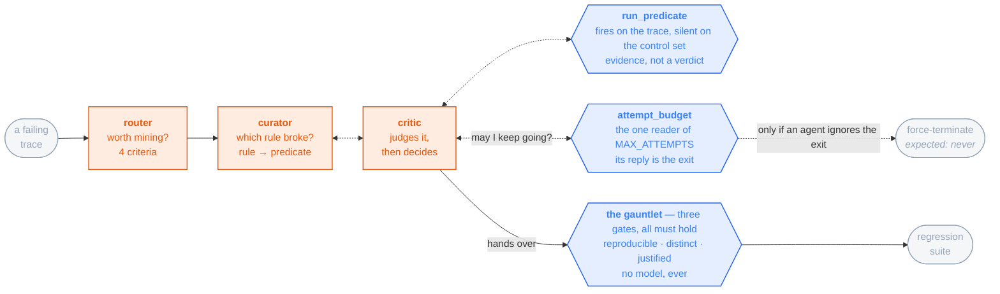

# touchstone

**An eval-repair loop for agentic systems.**

[](LICENSE)
[](pyproject.toml)
[](#status)

| | |
|---|---|
| **The problem** | An eval is wrong in two directions: it misses real failures, and it refuses correct fixes |
| **What it does** | Reads failing traces → mines them into eval cases → gates every candidate before it joins the suite |
| **The invariant** | ⛔ Nothing enters the suite except through a gate with **no model in it** |
| **The specimen** | [τ²-bench](https://github.com/sierra-research/tau2-bench) retail (MIT) — 114 customer-service tasks, scorer has no model in it. Deliberately someone else's: a project that owns both the agent and the answer key can improve either one, and you cannot tell from outside which it did |

## Status

| | |
|---|---|
| Implemented | `doctor`, `run`, `score` |
| Ever executed | ⛔ **`doctor` only** — `run` spends quota |
| Specified, not built | the loop, the gauntlet, the rest of the CLI |
| Complete | the docs, and the structural diagrams that gate implementation |
| Deferred | comparing versions — a comparator needs a second version and there isn't one |
| **The claim it is built to make** | **precision and recall** — *the gate fires on these traces and is silent on those*. ⛔ Not *the gate made the agent better* |

## The loop

```
one failing trace  →  up to MAX_ATTEMPTS attempts  →  a candidate eval case, or a recorded refusal
```

Three agents, and never a fourth.



Orange decides · blue verifies · grey is where a trace ends up. ⛔ **No orange box clears anything.**

### The three agents

| agent | asks | and the catch |
|---|---|---|
| **router** | Is this trace worth mining? Four criteria: **anomalous** · maps to a **written rule** · failure visible in the **process**, not just the end state · **specific** enough for a predicate | 🔴 **The expensive half.** What it skips becomes the control set a candidate must stay silent on. Criterion 1 duplicates τ²'s own signals and is not editable, so agreement with that key **is** the router's measured error rate — ⛔ no result from this loop is reportable without it |
| **curator** | Which rule broke, and what should the predicate say? | ⛔ **Against the suite that already exists, never in a vacuum.** Cleared predicates run against the trace first and the suite index goes into the prompt, so two cases cannot encode one rule in different words |
| **critic** | Bounce, hand over, or give up? | The loop's **decision point**, and the only thing that judges the curator's call. **Testing is a choice, not a step** — a candidate quoting a task id is refused on the reading alone, and the attempt it would have cost is still there for one worth testing |

### The critic's two tools, and nobody else holds either

They exist for one reason between them: ⛔ **the graph reads a recorded call, never a model's account of one.**

| tool | hands back | why it is shaped this way |
|---|---|---|
| `run_predicate` | fired on the trace, silent on the control set | **Evidence, not a verdict.** The critic still decides |
| `attempt_budget` | keep going, or exit now | The **only** reader of `MAX_ATTEMPTS`. ⛔ The critic is never told the number in a prompt — a number in a prompt is a word, and it does not change when the config does |

Rules the loop holds itself to:

- **A bounce carries the specific finding.** *"This seems weak"* costs an attempt and teaches the curator nothing.
- **Giving up is a result, not an error.** *The agent was not smart enough* has no rule to translate — and a miner that has never given up has never been pointed at a failure it should refuse.
- **A tool cannot break a loop.** The break is a conditional edge placed *after* the tool, calling the same function the tool calls. Two places that know the cap are two places that can disagree about it.
- **Every trace carries an `exit_reason`.** A rate you cannot decompose is not a signal: cap-exhausted and quit-at-attempt-2 look identical without it.

🔴 **So inside the loop there is no mechanical gate at all — every branch is a model's.** Deliberate:
argue-run-revise puts more reasoning on one trace than a single test can. ⚠️ **But effort is not
correctness** — a loop can iterate its way to a confident wrong answer and nothing inside it can
tell. That is what the last boundary is for.

### The gauntlet — the last boundary

**Three boolean checks. No model, nothing to prompt.** They run downstream of the loop on a
finished candidate, and each refuses one way a bad case poisons a suite you must trust for months.

| gate | the check | what it refuses |
|---|---|---|
| **reproducible** | fails **all four** of τ²'s trials, on four distinct seeds — four draws, not one copied | **A flaky failure.** Clear a 3-of-4 case and the suite fails your agent at random, and you debug a regression that never happened. Clears **34 of 456** (file, task) pairs — 7.5%, the honest cost of the rule |
| **distinct** | no two cases share a `task_id`. A failure-signature check sits beside it and records `duplicate_of` rather than refusing | **A suite that grows without covering more.** The signature half does not refuse: it is a bucketing heuristic with 1–2 orders of magnitude of error, and ⛔ a refusal is undoable while a recorded suspicion is not |
| **justified** | `why`, `added` and `origin` all non-empty | **A case nobody can ever delete.** Six months on, one fails — real regression, or mined in a hurry? Without the rule, the date and the version, you keep it forever |

⚠️ **Backlog by dependency, not by choice.** It runs on a finished candidate and the loop is what
produces one. Safe exactly as long as nothing is being cleared into the suite.

📐 [`diagrams/loop.png`](diagrams/loop.png) is the gate artifact and **wins if it and this page ever
disagree** ([`diagrams/`](diagrams/README.md)). No code lands before an approved structural diagram.

## Why the specimen is someone else's

τ²'s `DB` check replays a task's gold actions on a fresh environment and diffs the end state.
Mechanical, and any path reaching an equivalent state passes — **so it is blind to how that state
was reached.**

```
an agent skips a required confirmation
  and still writes the correct row      →  DB == 1   (passes)

of the 1,712 retail simulations τ² ships:
  371  pass DB and fail an action check →  invisible to a `DB == 0` selector
```

- **Select on `DB == 0` alone and those 371 land in the silence set** — the population a new predicate must stay quiet on.
- So a predicate **correctly** catching a confirmation violation is thrown out as a false positive, **by an answer key that was itself wrong.**
- 🔴 **A broken eval does not just miss failures; it refuses the fix.** That is why the miner reads three signals and not one.

⚠️ **The reading is *blind to process*, never *the benchmark is broken*.** Grading final state is
correct for a gate and wrong for a selector — so `DB` stays the gating metric while the miner feeds
on the union. ⛔ **One number cannot do both jobs.** Derivation: [docs/02](docs/02-gates.md).

**The corpus:**

| | |
|---|---|
| what | the **1,712** simulations τ² already ships, over **107 of retail's 114 tasks** |
| the other seven | excluded, not repaired — their gold actions changed between the shipped runs and the current task file. ⛔ The two numbers travel together |
| ⛔ not a baseline | produced by four third-party agents behind a `gpt-4.1` user simulator. Their scores are quoted nowhere in this repo |
| ⛔ not the 456 | those pairs span all 114 tasks. **The two never divide into each other** |

## Quick start

```bash
git clone git@github.com:sandeepyadav1478/touchstone.git && cd touchstone
uv sync
uv run touchstone doctor     # asserts ANTHROPIC_API_KEY is *absent* — if it is set,
                             # runs quietly bill an API account, not the subscription
uv run touchstone run v1     # the frozen ten through τ², k=3
uv run touchstone score v1   # → results/v1.json, no model call
```

| | |
|---|---|
| `PATH` | `uv sync` does not install the entry point — use `uv run touchstone …`, or activate `.venv` first |
| `TAU2_DATA_DIR` | `run` needs it, and writes into **that** tree rather than this one. `doctor` tells you whether it resolves |
| the rest of the CLI | specified in [docs/06](docs/06-api.md), **not implemented** |

**Models** ([docs/00](docs/00-stack.md)):

| | |
|---|---|
| how | Claude via [`claude-agent-sdk`](https://github.com/anthropics/claude-agent-sdk-python), which drives the `claude` CLI as a subprocess and inherits its login |
| what that buys | a **Claude Code subscription rather than a metered API key**. Running a suite k times per task is the point of this repo, and that is what makes it affordable |
| ⛔ the rule | **Anthropic models only, in every role.** Five roles pinned separately, every id taken from a live call rather than a config file |

## Limits

⚠️ **Read this before quoting any number this repo produces.** These are properties of the
**design**, so they hold whether or not a run has happened. Full list: [docs/05](docs/05-scoring.md).

| limit | what it does to a number |
|---|---|
| 🔴 **Nothing here has been run by this project** | The traces are someone else's. A gate that fires on their failures is not thereby shown to fire on ours |
| **The customer is a language model** | τ²'s user side is a simulator, so a failure it causes is charged to the agent unless something measures it — and the corpus was already run, so **we cannot measure its fabrication rate ourselves** |
| **Enforcement has never run live** | Tested by replay only. ⚠️ *Wired but never seen to fire* reads exactly like *works* |
| **The gate is a component, not the reward** | Gates on `reward_breakdown["DB"]`; retail's composite adds an LLM-judged `NL_ASSERTION` on **112 of 114** tasks. Both are reported — ⛔ they are different measurements |
| **The agent does not learn** | No training, no fine-tuning, no weights, nothing carried between sessions; memory is designed ([docs/08](docs/08-memory.md)) and unbuilt. ⛔ *"It improves itself"* fuses two loops — **what iterates is the ruler**, never the thing measured |
| 🔴 **A run covers ten of 114 tasks** | Frozen and hash-recorded, so it cannot be re-sampled to flatter a result — and still a tenth of the exam. ⛔ **Not a τ²-bench retail score** |
| **Nothing compares two versions** | `compare`, the run record and the version table are unbuilt. A comparator with no second operand is scaffolding |
| **A benchmark task is cleaner than a ticket** | Gold actions known, small database, a right answer — so the reward is an **upper bound** on a harder problem. No claim about time-to-resolution, ticket volume, or a human comparison |

## Documentation

| Doc | What it covers |
|---|---|
| [docs/00-stack.md](docs/00-stack.md) | Every dependency pinned and why, the five model pins, `touchstone doctor` |
| [docs/01-spec.md](docs/01-spec.md) | The τ² task model, what a case is, the benchmark manifest, the live invariants |
| [docs/02-gates.md](docs/02-gates.md) | The gauntlet's three gates, the two tiers, the acceptance rule, case provenance |
| [docs/03-agent-and-tools.md](docs/03-agent-and-tools.md) | The adapter at the model seam, what we may and may not change about the τ² agent |
| [docs/04-observability.md](docs/04-observability.md) | Span schema, OpenInference conventions, why the scorer reads spans |
| [docs/05-scoring.md](docs/05-scoring.md) | Reward, `pass^k`, cost per success, and why a judge can never gate |
| [docs/06-api.md](docs/06-api.md) | CLI, HTTP surface, compose |
| [docs/07-diagrams.md](docs/07-diagrams.md) | The gate: no code before an approved structural diagram |
| [docs/08-memory.md](docs/08-memory.md) | Where agent memory legitimately goes, and the anchoring failure it is planted to catch |
| [docs/09-schemas.md](docs/09-schemas.md) | Every remaining type, the `benchmark_hash` algorithm, the file map, prompt and tool contracts |
| [diagrams/](diagrams/README.md) | The structural flowchart and the run sequence |

⚠️ **The docs specify the deferred comparison half in the present tense, deliberately.** Where they
reason about comparing a candidate against an incumbent, they describe the design that half revives
to, not code that runs. Nothing was deleted — the arguments are why each piece is shaped as it is.

**Working files.** `DECISIONS.md`, `DEFECTS.md` and `ROADMAP.md` — the decision register, the defect
log and the schedule — are **local by design and not in this repository.** That is why `D-084` and
the like are cited in backticks and never as links: a link would 404 for every reader. The reasoning
that survives is in `docs/`.

## Prior work this builds on

| | |
|---|---|
| [τ²-bench](https://github.com/sierra-research/tau2-bench) (MIT) | The specimen — corpus, environment, evaluator. **We drive it; we do not fork it.** Pinned at commit `a2c024725189`, ⛔ not at `1.0.1`, which names two different trees |
| [`tracebench`](https://github.com/sandeepyadav1478/tracebench) | Reliability over OTel spans; where the `pass^k` framing came from |
| [`evalloop`](https://github.com/sandeepyadav1478/evalloop) | Mining eval sets from traces, and the health guard that refuses to report drift from a dead window |

## Citation

Cite it as software, **and state the commit** — the design is under active revision, and what was
read at that commit changes what the claim means. ⛔ **If you use anything measured here, cite
τ²-bench too:** the corpus, the environment and the evaluator are theirs, and every number on this
page derives from simulations they produced and shipped.

<details>
<summary>BibTeX — touchstone, τ²-bench, τ-bench</summary>

```bibtex
@software{yadav2026touchstone,
  author  = {Yadav, Sandeep},
  title   = {touchstone: an eval-repair loop for agentic systems},
  year    = {2026},
  url     = {https://github.com/sandeepyadav1478/touchstone},
  license = {MIT},
  note    = {Work in progress; cite the commit you read}
}

@misc{barres2025tau2,
  title         = {$\tau^2$-Bench: Evaluating Conversational Agents in a Dual-Control Environment},
  author        = {Victor Barres and Honghua Dong and Soham Ray and Xujie Si and Karthik Narasimhan},
  year          = {2025},
  eprint        = {2506.07982},
  archivePrefix = {arXiv},
  primaryClass  = {cs.AI},
  url           = {https://arxiv.org/abs/2506.07982}
}

@misc{yao2024tau,
  title         = {$\tau$-bench: A Benchmark for Tool-Agent-User Interaction in Real-World Domains},
  author        = {Shunyu Yao and Noah Shinn and Pedram Razavi and Karthik Narasimhan},
  year          = {2024},
  eprint        = {2406.12045},
  archivePrefix = {arXiv},
  primaryClass  = {cs.AI},
  url           = {https://arxiv.org/abs/2406.12045}
}
```

</details>

## License

MIT. See [LICENSE](LICENSE).
