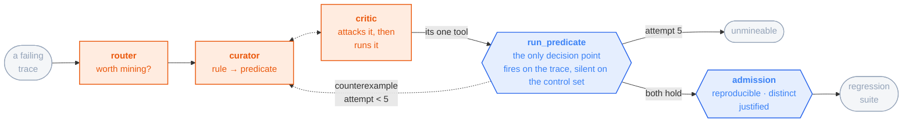

# touchstone

**An eval-repair loop for agentic systems.**

[](LICENSE)
[](pyproject.toml)
[](#status)

An agent is only as good as the evals judging it, and an eval is wrong in two directions: it
misses real failures, and it refuses correct fixes. touchstone mines failures into new eval
cases, admits them through mechanical gates, and enforces them — so the suite keeps getting
stricter and the agent has to keep passing it.

⛔ **The invariant: anything that gates is mechanical; anything with a model in it cannot gate.**
A model's only job is **translation** — turning a written policy constraint into a predicate over
the database. The **verdict** is always a predicate, never a judgement.

**The loop is the product; the domain is a specimen.** A project that owns both the agent and the
answer key can improve either one, and you cannot tell from the outside which it did. So the
specimen is a third party's: **[τ²-bench](https://github.com/sierra-research/tau2-bench) retail**,
MIT, 114 customer-service tasks with a scorer that has **no model in it**.

## Status

**In progress.** `touchstone doctor` runs. The specification ([`docs/`](#documentation)) and the
structural diagrams that gate implementation are complete. The loop itself is not built.

🔴 **The candidate-comparison half is deferred** — running the suite to produce v1…v5 and deciding
whether one beats the last. Running the benchmark is τ²'s own work, done well, and a comparator
needs a second version that does not exist. What is being built is the other half: **mine a
mechanical gate out of a trace, and enforce it.** So the claim this repo will make is **precision
and recall** — *the gate fires on these traces and is silent on those* — ⛔ **not** *the gate made
the agent better*.

## The finding that shaped the design

τ²'s `DB` check replays a task's gold actions on a fresh environment and diffs the agent's end
state against the result. It is mechanical, and any path reaching an equivalent state passes.

**It compares final state, so it is blind to how that state was reached.** An agent that skips a
required confirmation and still writes the correct row scores `DB == 1`. Over the corpus below:

```
834 anomalous = 407  the DB check failed
              + 371  DB PASSED, action_check failed
              +  56  a WRITE nobody confirmed, which action_checks cannot see
878 clean     = none of the three — THE SILENCE SET
```

🔴 **Those 371 are why the miner reads three signals and not one.** Selecting on `DB == 0` alone
leaves them in the silence set — the population a new predicate must be quiet on to be admitted —
so a predicate **correctly** catching a confirmation violation would have been thrown out as a
false positive, by an answer key that was itself wrong. **A broken eval does not just miss
failures; it refuses the fix.**

⚠️ **Say *blind to process*, never *the benchmark is broken*.** Grading final state is **correct
for a gate** and wrong for a selector — which is why `DB` stays the gating metric while the miner
feeds on the union. ⛔ **One number cannot do both jobs.** The 56 is an **upper bound** from a
regex over the last user message before each WRITE; it justifies widening the selector and is
**not a figure to quote**. Full derivation: [docs/02](docs/02-gates.md).

## The corpus

**1,712 simulations τ²-bench already ships**, over **107 of retail's 114 tasks** — the ones whose
gold actions are unchanged between the shipped runs and the current task file. ⛔ **The other
seven are excluded, not repaired, and the two numbers travel together — never write 114.**

⛔ **This is a corpus, never a baseline.** Those simulations were produced by four third-party
agents behind a `gpt-4.1` user simulator. **Their scores are quoted nowhere in this repo**;
putting them beside a number of ours would fuse two environments.

## How it works

**One routed trace, up to 5 attempts, seconds.** Three agents propose; one predicate decides.



**Orange proposes, blue decides** — and ⛔ **no orange box admits anything.** The curator and the
critic argue inside one attempt, one bounce each, so the loop cannot burn all five arguing and
reach `unmineable` having never run a predicate. `run_predicate` is the **critic's one tool**
(D-085) — it runs the check itself and sees the result inside its own turn, which is the only
point in this loop where an opinion can be tested against the mechanism for the cost of one call.
⛔ **Invoking is not adjudicating.** The graph reads the **tool result**, never the critic's
account of it, so the verdict stays mechanical (D-064) while the objection finally gets checked.
`run_predicate` is still the only decision point (D-081), still where the control set arrives, and
every exit leaves from it.

⛔ **Two hand-backs, not one, and which one you get is the critic's call.** It returns an
**argument** — does the candidate quote a `task_id`? does it restate the trace instead of the
rule? — and it **may** send that back having run nothing, which is the cheap refusal worth
keeping. Or it runs first and sends the **counterexample** with it: the clean session the
predicate wrongly fired on, or the fact that it missed the target. Attempt *i+1* sees what attempt *i* got wrong. `unmineable` is a
**result, not an error** — *the agent was not smart enough* has no rule to translate, and a miner
that has never given up has never been pointed at a failure it should refuse.

🔴 **The router is the one place a model shapes the answer key**, and it is the expensive half of
this design: what it skips becomes the control set a candidate must not fire on. Its verdicts are
scored against τ²'s own three signals — the 834/878 split above — and ⛔ **no result from this loop
is reportable without that agreement figure.** If it comes back poor, the rubric drops to a
diagnostic and selection reverts to mechanical.

**Two attachment points, both upstream, both one function.**

| point | where | why it is the only one |
|---|---|---|
| the model seam | `tau2/utils/llm_utils.py` `generate()` | **all four** of τ²'s model roles cross it — agent, user simulator, hallucination reviewer, NL-assertion evaluator. One adapter puts the Claude Agent SDK behind every one without touching a call site |
| the enforcement point | `tau2.environment.Environment.make_tool_call()` | every tool execution already passes through it, and it already knows which tools mutate state |

📐 **The flowchart above is a summary; the gate artifact is
[`diagrams/`](diagrams/README.md)**, rendered as [`loop.png`](diagrams/loop.png) — it carries the
benchmark tier, the memory registry and the lift path, and **it wins if the two ever disagree.**
No code lands before an approved structural diagram. **The spans are the score:** the scorer reads
the trace — which tools were called, how many tokens, what the reward decomposed into — never
prose.

## Quick start

```bash
git clone git@github.com:sandeepyadav1478/touchstone.git && cd touchstone
uv sync
uv run touchstone doctor     # ⛔ asserts ANTHROPIC_API_KEY is *absent* — if it is set,
                             #    runs quietly bill an API account, not the subscription
```

⚠️ `uv sync` does not put `touchstone` on your `PATH` — use `uv run touchstone …`, or activate
`.venv` first. The rest of the CLI is specified in [docs/06](docs/06-api.md) and **not yet
implemented**; listed because the spec is fixed, not because it runs:

```bash
touchstone suite freeze --domain retail   # ⬜ pin the task ids and hash them
touchstone mine --from results/final      # ⬜ one anomalous trace → a candidate predicate
touchstone suite admit r-018              # ⬜ three mechanical gates → the regression suite
touchstone run --enforce                  # ⬜ the predicate refuses the call before it runs
```

**Models.** The agent runs on **Claude, through
[`claude-agent-sdk`](https://github.com/anthropics/claude-agent-sdk-python)**, which drives the
`claude` CLI as a subprocess and inherits its login — so a run goes through a **Claude Code
subscription rather than a metered API key**. Running a suite k times per task is the whole point
of this repo, and that is what makes it affordable. ⛔ **Anthropic models only, in every role**;
five roles are pinned separately and every id comes from a live call rather than a config file.
Manifest: [docs/00](docs/00-stack.md).

## Limits

**Read this before quoting any number this repo ever produces.** These are properties of the
design, so they hold whether or not a run has happened. The full list is in
[docs/05](docs/05-scoring.md); these are the ones that change what a number means.

- 🔴 **Nothing here has been run by this project, and the traces it reasons over are somebody
  else's.** A gate that fires on their failures is not thereby shown to fire on ours.
- **The customer is a language model.** τ²'s user side is a simulator, so a failure it causes is
  attributed to the agent unless something measures it — and because the corpus was already run,
  **we can no longer measure its fabrication rate ourselves.**
- **Enforcement is tested by replay and has never run against a live environment.** *Wired but
  never seen to fire* reads exactly like *works*.
- **The gate is a component, not the whole reward.** touchstone gates on `reward_breakdown["DB"]`
  because retail's composite includes an LLM-judged `NL_ASSERTION` on **112 of 114** tasks. Both
  are reported. ⛔ **A `DB` figure and a composite figure are different measurements.**
- **The agent does not learn.** Nothing trains, fine-tunes or updates weights. ⛔ **"It improves
  itself" fuses two loops and is false on the half that matters** — what iterates is the **ruler**,
  never the thing being measured.
- 🔴 **No `pass^k` figure appears anywhere in this repo.** It needs repeated attempts by *our*
  agent and there are none. ⛔ It is **not** `pass@k`.
- **τ² can change its tasks under us; it already has.** Storing task ids and a hash makes a moved
  corpus detectable rather than silent.
- **A benchmark task is cleaner than a real ticket** — gold actions known, small database, a right
  answer. **That makes the reward an upper bound on a harder problem.** Single service, single
  machine; no claim about time-to-resolution, ticket volume, or comparison against a human agent.

## Documentation

| Doc | What it covers |
|---|---|
| [docs/00-stack.md](docs/00-stack.md) | Every dependency pinned and why, the five model pins, `touchstone doctor` |
| [docs/01-spec.md](docs/01-spec.md) | The τ² task model, what a case is, the benchmark manifest, the live invariants |
| [docs/02-gates.md](docs/02-gates.md) | ⛔ **The three admission gates**, the two tiers, the acceptance rule, the stages, case provenance |
| [docs/03-agent-and-tools.md](docs/03-agent-and-tools.md) | The adapter at the seam, what we may and may not change about the τ² agent |
| [docs/04-observability.md](docs/04-observability.md) | Span schema, OpenInference conventions, why the scorer reads spans |
| [docs/05-scoring.md](docs/05-scoring.md) | Reward, `pass^k`, cost per success — and why a judge can never gate |
| [docs/06-api.md](docs/06-api.md) | CLI, HTTP surface, compose |
| [docs/07-diagrams.md](docs/07-diagrams.md) | ⛔ **The gate: no code before an approved structural diagram** |
| [docs/08-memory.md](docs/08-memory.md) | Where agent memory legitimately goes, and the anchoring failure it is planted to catch |
| [docs/09-schemas.md](docs/09-schemas.md) | Every remaining type, the `benchmark_hash` algorithm, the file map, prompt and tool contracts |
| [diagrams/](diagrams/README.md) | 📐 **The gate artifacts** — the structural flowchart and the run sequence |

🔴 **`docs/` specifies the deferred half in the present tense, deliberately.** Wherever they reason
about comparing a candidate against an incumbent, they describe **the design that half revives
to**, not code that runs. ⛔ **Nothing was deleted** — the arguments are why each piece is shaped
the way it is, and they would have to be re-derived otherwise.

## Prior work this builds on

- [τ²-bench](https://github.com/sierra-research/tau2-bench) (MIT) — the specimen: the corpus, the
  environment and the evaluator. **We drive it; we do not fork it.** Pinned at commit
  `a2c024725189`. ⛔ **Not `1.0.1`** — that string names two different trees.
- [`tracebench`](https://github.com/sandeepyadav1478/tracebench) — reliability over OTel spans;
  where the `pass^k` framing came from.
- [`evalloop`](https://github.com/sandeepyadav1478/evalloop) — mining eval sets from traces, and
  the health guard that refuses to report drift from a dead window.

## Citation

If you refer to this work, cite it as software — ⚠️ **and state the commit**, because the design
is under active revision and what was read at that commit changes what the claim means.

```bibtex
@software{yadav2026touchstone,
  author  = {Yadav, Sandeep},
  title   = {touchstone: an eval-repair loop for agentic systems},
  year    = {2026},
  url     = {https://github.com/sandeepyadav1478/touchstone},
  license = {MIT},
  note    = {Work in progress; cite the commit you read}
}
```

⛔ **If you use anything measured here, cite τ²-bench too** — the corpus, the environment and the
evaluator are theirs, and every number on this page is derived from simulations they produced and
shipped.

```bibtex
@misc{barres2025tau2,
  title         = {$\tau^2$-Bench: Evaluating Conversational Agents in a Dual-Control Environment},
  author        = {Victor Barres and Honghua Dong and Soham Ray and Xujie Si and Karthik Narasimhan},
  year          = {2025},
  eprint        = {2506.07982},
  archivePrefix = {arXiv},
  primaryClass  = {cs.AI},
  url           = {https://arxiv.org/abs/2506.07982}
}

@misc{yao2024tau,
  title         = {$\tau$-bench: A Benchmark for Tool-Agent-User Interaction in Real-World Domains},
  author        = {Shunyu Yao and Noah Shinn and Pedram Razavi and Karthik Narasimhan},
  year          = {2024},
  eprint        = {2406.12045},
  archivePrefix = {arXiv},
  primaryClass  = {cs.AI},
  url           = {https://arxiv.org/abs/2406.12045}
}
```

## License

MIT. See [LICENSE](LICENSE).
