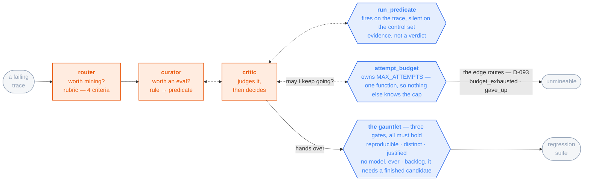

# touchstone

**An eval-repair loop for agentic systems.**

[](LICENSE)
[](pyproject.toml)
[](#status)

An agent is only as good as the evals judging it, and an eval is wrong in two directions: it
misses real failures, and it refuses correct fixes. touchstone mines failures into new eval
cases, clears them through mechanical gates, and enforces them — so the suite keeps getting
stricter and the agent has to keep passing it.

⛔ **The invariant: nothing enters the suite except through a mechanical gate.** Models do the
mining — they read the trace, decide what is worth encoding, write the predicate, argue about it
and run it. ⛔ **What they cannot do is clear anything.** The three checks that stand between a
finished candidate and the suite have no model in them (D-084), and ⚠️ **since D-086 they are the
only checks that do not** — the loop itself is model-decided end to end, deliberately, and the
guarantee lives at the suite boundary rather than inside the loop.

**The loop is the product; the domain is a specimen.** A project that owns both the agent and the
answer key can improve either one, and you cannot tell from the outside which it did. So the
specimen is a third party's: **[τ²-bench](https://github.com/sierra-research/tau2-bench) retail**,
MIT, 114 customer-service tasks with a scorer that has **no model in it**.

## Status

**In progress.** `touchstone doctor` runs. The specification ([`docs/`](#documentation)) and the
structural diagrams that gate implementation are complete. The loop itself is not built.

🔴 **The candidate-comparison half is deferred** — running the suite to produce v1…v5 and deciding
whether one beats the last. Running the benchmark is τ²'s own work, done well, and a comparator
needs a second version that does not exist. What is being built is the other half: **mine a
mechanical gate out of a trace, and enforce it.** So the claim this repo will make is **precision
and recall** — *the gate fires on these traces and is silent on those* — ⛔ **not** *the gate made
the agent better*.

## The finding that shaped the design

τ²'s `DB` check replays a task's gold actions on a fresh environment and diffs the agent's end
state against the result. It is mechanical, and any path reaching an equivalent state passes.

**It compares final state, so it is blind to how that state was reached.** An agent that skips a
required confirmation and still writes the correct row scores `DB == 1`. Over the corpus below:

```
834 anomalous = 407  the DB check failed
              + 371  DB PASSED, action_check failed
              +  56  a WRITE nobody confirmed, which action_checks cannot see
878 clean     = none of the three — THE SILENCE SET
```

🔴 **Those 371 are why the miner reads three signals and not one.** Selecting on `DB == 0` alone
leaves them in the silence set — the population a new predicate must be quiet on to be cleared —
so a predicate **correctly** catching a confirmation violation would have been thrown out as a
false positive, by an answer key that was itself wrong. **A broken eval does not just miss
failures; it refuses the fix.**

⚠️ **Say *blind to process*, never *the benchmark is broken*.** Grading final state is **correct
for a gate** and wrong for a selector — which is why `DB` stays the gating metric while the miner
feeds on the union. ⛔ **One number cannot do both jobs.** The 56 is an **upper bound** from a
regex over the last user message before each WRITE; it justifies widening the selector and is
**not a figure to quote**. Full derivation: [docs/02](docs/02-gates.md).

## The corpus

**1,712 simulations τ²-bench already ships**, over **107 of retail's 114 tasks** — the ones whose
gold actions are unchanged between the shipped runs and the current task file. ⛔ **The other
seven are excluded, not repaired, and the two numbers travel together — never write 114.**

⛔ **This is a corpus, never a baseline.** Those simulations were produced by four third-party
agents behind a `gpt-4.1` user simulator. **Their scores are quoted nowhere in this repo**;
putting them beside a number of ours would fuse two environments.

## How it works

**One routed trace, up to `MAX_ATTEMPTS` attempts, seconds.** ⛔ **Three agents, and never a fourth** — the
router picks, the curator decides what is worth encoding, the critic judges what the curator did.



**Orange decides, blue verifies, grey is what exists on disk when it is over** — and ⛔ **no
orange box clears anything.** The three grey nodes are the whole input and output of the loop: one
trace goes in, and either a **regression suite** case or an **unmineable** comes out. ⚠️ **Those
two sit in the same structural slot** — a blue mechanical box writes each of them — so a diagram
that drops `unmineable` is claiming the loop has one outcome. The **curator** is the
centre of gravity: it decides whether a failure is worth an eval at all, which rule it broke, and
what the predicate should say — ⛔ **against the suite that already exists, never in a vacuum**
(D-087). A rule already gated is not worth mining twice, so an exact check runs the cleared
predicates against the trace first, and the suite index goes into the curator's prompt so that two
cases cannot encode one rule in different words. The **critic** is the only thing that judges that call, and it is
the loop's decision point (D-086): it reads the curator's candidate, calls `run_predicate`, reads
what comes back, and chooses — bounce, hand over, or give up. ⛔ **A bounce carries the specific
bad finding, never *"this seems weak"*** — a vague objection costs one attempt and teaches
the curator nothing. `unmineable` is a **result, not an error**: *the agent was not smart enough*
has no rule to translate, and a miner that has never given up has never been pointed at a failure
it should refuse.

**The critic holds two tools and nobody else holds either** (D-085, D-089), and they exist for one
reason between them — ⛔ **the graph reads a recorded call, never a model's account of one.**
`run_predicate` fires the candidate at the trace and at the control set and hands back what
happened; it is the loop's only mechanical step and ⛔ **under D-086 it is no longer a gate** — it
supplies the evidence, the critic supplies the decision. `attempt_budget` is the second tool, and it is
named for the job rather than the consequence (D-092): the critic asks whether it may keep going,
and the tool reads `MAX_ATTEMPTS` and answers — keep going, or exit now. ⛔ **The critic never counts attempts itself and is never told the number in a
prompt**, because a number in a prompt is a word and does not change when the config does. The same
tool records a give-up and **may refuse one**: D-082 wants at least one `run_predicate` result behind
every unmineable, and this is the moment that check can fire. **Refusing and terminating are
different verbs** — a refused give-up costs an attempt and never buys one.

⛔ **A tool cannot break a loop** — it returns to its caller, so the break is the graph's conditional
edge placed *after* the tool node, and it calls the same `attempts_exhausted()` the tool does. Two
places that know the cap are two places that can disagree about it (D-091); putting the edge after
the tool rather than after the critic also saves a model turn spent repeating back what the tool just
said (D-093). ⛔ **Every mined trace carries an `exit_reason`** — `handed_over`, `budget_exhausted` or
`gave_up` — written by the edge, because the edge is what decided. **A rate you cannot decompose is
not a signal**, and without that split a cap-exhausted trace and a critic that quit at attempt 2 look
identical. 🔴 **A model with a give-up button will
press it** — a correct refusal and a lazy one produce the identical artefact, so the unmineable rate
is watched against the router's agreement number rather than trusted on its own (D-089 §D). Flags
any agent raises land in the MLflow span for a human to read; ⛔ **the loop does not branch on
them**, because a loop that branches on a flag lets an agent extend its own run by raising one.

🔴 **So inside the loop there is now no mechanical gate at all — every branch is a model's.** That
is deliberate: repeated argue-run-revise puts **more** reasoning on one trace than a single
test can (D-087 §E). ⚠️ **But effort is not correctness** — a loop can iterate its way to a
confident wrong answer, and nothing inside it can tell. That is what the last boundary is for, and
it is untouched: ⛔ **nothing enters the suite without clearing the gauntlet.**

**The gauntlet is three boolean checks — not an agent, no model, nothing to prompt.** They run
**downstream of the loop** on a finished candidate, and each one refuses a specific way a bad case
poisons a suite you have to trust for months:

| gate | the check | what it refuses, and why that matters |
|---|---|---|
| **reproducible** | the case fails **all 4** of τ²'s trials, not some — `all(reward_breakdown["DB"] == 0)`, and ⚠️ **the 4 trials carry 4 distinct seeds**, so they are four draws rather than one copied | **A flaky failure.** It is `pass^4` inverted: a case is cleared only if it is as reliable a *failure* as a shipped pass is a *pass*. Clear a 3-of-4 case and the suite fails your agent at random, and you debug a regression that never happened. ⛔ **Clears 34 of 456** (file,task) pairs — 7.5%, and that yield is the honest cost of the rule |
| **distinct** | no two cases share a `task_id` — this one **refuses**. A failure-signature check sits beside it and ✅ **records `duplicate_of` instead of refusing** | **A suite that grows without covering more**, and a pass rate that counts one failure mode twice. The signature half does not refuse because it is a **bucketing heuristic measured at 1–2 orders of magnitude of error** — an over-merge would reject a real, different failure permanently, and ⛔ **a refusal is undoable while a recorded suspicion is not** |
| **justified** | `why`, `added` and `origin` are all non-empty | **A case nobody can ever delete.** Six months on, one fails: is it a real regression, or something mined in a hurry? Without the rule it encodes, when it arrived and which version produced it, you cannot answer — so you keep it forever, and the suite ratchets on cases no one can defend |

⚠️ **The gauntlet is backlog, and that is a dependency rather than a choice.** It runs on a
*finished candidate* and the loop is what produces one, so its input does not exist yet — ⛔ **it
cannot be built early even if you want to.** It is not deferred and not dropped; it is the next
thing after the loop works, and holding it there is safe exactly as long as nothing is being
cleared into the suite.

⚠️ **Two populations are in play and they are not the same one.** The 34-of-456 figure is over the
**full** shipped retail set — 456 (file,task) pairs × 4 trials = **1,824** simulations across all
114 tasks. The **1,712 / 107 tasks** above is the corpus this project mines. ⛔ **Never divide one
by the other.**

🔴 **The router is the one place a model shapes the answer key**, and it is the expensive half of
this design: what it skips becomes the control set a candidate must not fire on. It grades each
trace on **four criteria** (D-086 §B) — *is this anomalous · does it map to a written rule · is the
failure visible in the process, not just the end state · is it specific enough to write a predicate
over*. ⛔ **The first is not editable**: it duplicates τ²'s own three signals, so agreement with the
834/878 split above **is** the router's measured error rate, and ⛔ **no result from this loop is
reportable without that figure.** If it comes back poor, the rubric drops to a diagnostic and
selection reverts to mechanical.

**Two attachment points, both upstream, both one function.**

| point | where | why it is the only one |
|---|---|---|
| the model seam | `tau2/utils/llm_utils.py` `generate()` | **all four** of τ²'s model roles cross it — agent, user simulator, hallucination reviewer, NL-assertion evaluator. One adapter puts the Claude Agent SDK behind every one without touching a call site |
| the enforcement point | `tau2.environment.Environment.make_tool_call()` | every tool execution already passes through it, and it already knows which tools mutate state |

📐 **The flowchart above is a summary; the gate artifact is
[`diagrams/`](diagrams/README.md)**, rendered as [`loop.png`](diagrams/loop.png) — it carries the
benchmark tier, the memory registry and the lift path, and **it wins if the two ever disagree.**
No code lands before an approved structural diagram. **The spans are the score:** the scorer reads
the trace — which tools were called, how many tokens, what the reward decomposed into — never
prose.

## Quick start

```bash
git clone git@github.com:sandeepyadav1478/touchstone.git && cd touchstone
uv sync
uv run touchstone doctor     # ⛔ asserts ANTHROPIC_API_KEY is *absent* — if it is set,
                             #    runs quietly bill an API account, not the subscription
```

⚠️ `uv sync` does not put `touchstone` on your `PATH` — use `uv run touchstone …`, or activate
`.venv` first. The rest of the CLI is specified in [docs/06](docs/06-api.md) and **not yet
implemented**; listed because the spec is fixed, not because it runs:

```bash
touchstone suite freeze --domain retail   # ⬜ pin the task ids and hash them
touchstone mine --from results/final      # ⬜ one anomalous trace → a candidate predicate
touchstone suite gauntlet r-018              # ⬜ three mechanical gates → the regression suite
touchstone run --enforce                  # ⬜ the predicate refuses the call before it runs
```

**Models.** The agent runs on **Claude, through
[`claude-agent-sdk`](https://github.com/anthropics/claude-agent-sdk-python)**, which drives the
`claude` CLI as a subprocess and inherits its login — so a run goes through a **Claude Code
subscription rather than a metered API key**. Running a suite k times per task is the whole point
of this repo, and that is what makes it affordable. ⛔ **Anthropic models only, in every role**;
five roles are pinned separately and every id comes from a live call rather than a config file.
Manifest: [docs/00](docs/00-stack.md).

## Limits

**Read this before quoting any number this repo ever produces.** These are properties of the
design, so they hold whether or not a run has happened. The full list is in
[docs/05](docs/05-scoring.md); these are the ones that change what a number means.

- 🔴 **Nothing here has been run by this project, and the traces it reasons over are somebody
  else's.** A gate that fires on their failures is not thereby shown to fire on ours.
- **The customer is a language model.** τ²'s user side is a simulator, so a failure it causes is
  attributed to the agent unless something measures it — and because the corpus was already run,
  **we can no longer measure its fabrication rate ourselves.**
- **Enforcement is tested by replay and has never run against a live environment.** *Wired but
  never seen to fire* reads exactly like *works*.
- **The gate is a component, not the whole reward.** touchstone gates on `reward_breakdown["DB"]`
  because retail's composite includes an LLM-judged `NL_ASSERTION` on **112 of 114** tasks. Both
  are reported. ⛔ **A `DB` figure and a composite figure are different measurements.**
- **The agent does not learn.** Nothing trains, fine-tunes or updates weights. ⛔ **"It improves
  itself" fuses two loops and is false on the half that matters** — what iterates is the **ruler**,
  never the thing being measured.
- 🔴 **No `pass^k` figure appears anywhere in this repo.** It needs repeated attempts by *our*
  agent and there are none. ⛔ It is **not** `pass@k`.
- **τ² can change its tasks under us; it already has.** Storing task ids and a hash makes a moved
  corpus detectable rather than silent.
- **A benchmark task is cleaner than a real ticket** — gold actions known, small database, a right
  answer. **That makes the reward an upper bound on a harder problem.** Single service, single
  machine; no claim about time-to-resolution, ticket volume, or comparison against a human agent.

## Documentation

| Doc | What it covers |
|---|---|
| [docs/00-stack.md](docs/00-stack.md) | Every dependency pinned and why, the five model pins, `touchstone doctor` |
| [docs/01-spec.md](docs/01-spec.md) | The τ² task model, what a case is, the benchmark manifest, the live invariants |
| [docs/02-gates.md](docs/02-gates.md) | ⛔ **The gauntlet's three gates**, the two tiers, the acceptance rule, the stages, case provenance |
| [docs/03-agent-and-tools.md](docs/03-agent-and-tools.md) | The adapter at the seam, what we may and may not change about the τ² agent |
| [docs/04-observability.md](docs/04-observability.md) | Span schema, OpenInference conventions, why the scorer reads spans |
| [docs/05-scoring.md](docs/05-scoring.md) | Reward, `pass^k`, cost per success — and why a judge can never gate |
| [docs/06-api.md](docs/06-api.md) | CLI, HTTP surface, compose |
| [docs/07-diagrams.md](docs/07-diagrams.md) | ⛔ **The gate: no code before an approved structural diagram** |
| [docs/08-memory.md](docs/08-memory.md) | Where agent memory legitimately goes, and the anchoring failure it is planted to catch |
| [docs/09-schemas.md](docs/09-schemas.md) | Every remaining type, the `benchmark_hash` algorithm, the file map, prompt and tool contracts |
| [diagrams/](diagrams/README.md) | 📐 **The gate artifacts** — the structural flowchart and the run sequence |

🔴 **`docs/` specifies the deferred half in the present tense, deliberately.** Wherever they reason
about comparing a candidate against an incumbent, they describe **the design that half revives
to**, not code that runs. ⛔ **Nothing was deleted** — the arguments are why each piece is shaped
the way it is, and they would have to be re-derived otherwise.

## Prior work this builds on

- [τ²-bench](https://github.com/sierra-research/tau2-bench) (MIT) — the specimen: the corpus, the
  environment and the evaluator. **We drive it; we do not fork it.** Pinned at commit
  `a2c024725189`. ⛔ **Not `1.0.1`** — that string names two different trees.
- [`tracebench`](https://github.com/sandeepyadav1478/tracebench) — reliability over OTel spans;
  where the `pass^k` framing came from.
- [`evalloop`](https://github.com/sandeepyadav1478/evalloop) — mining eval sets from traces, and
  the health guard that refuses to report drift from a dead window.

## Citation

If you refer to this work, cite it as software — ⚠️ **and state the commit**, because the design
is under active revision and what was read at that commit changes what the claim means.

```bibtex
@software{yadav2026touchstone,
  author  = {Yadav, Sandeep},
  title   = {touchstone: an eval-repair loop for agentic systems},
  year    = {2026},
  url     = {https://github.com/sandeepyadav1478/touchstone},
  license = {MIT},
  note    = {Work in progress; cite the commit you read}
}
```

⛔ **If you use anything measured here, cite τ²-bench too** — the corpus, the environment and the
evaluator are theirs, and every number on this page is derived from simulations they produced and
shipped.

```bibtex
@misc{barres2025tau2,
  title         = {$\tau^2$-Bench: Evaluating Conversational Agents in a Dual-Control Environment},
  author        = {Victor Barres and Honghua Dong and Soham Ray and Xujie Si and Karthik Narasimhan},
  year          = {2025},
  eprint        = {2506.07982},
  archivePrefix = {arXiv},
  primaryClass  = {cs.AI},
  url           = {https://arxiv.org/abs/2506.07982}
}

@misc{yao2024tau,
  title         = {$\tau$-bench: A Benchmark for Tool-Agent-User Interaction in Real-World Domains},
  author        = {Shunyu Yao and Noah Shinn and Pedram Razavi and Karthik Narasimhan},
  year          = {2024},
  eprint        = {2406.12045},
  archivePrefix = {arXiv},
  primaryClass  = {cs.AI},
  url           = {https://arxiv.org/abs/2406.12045}
}
```

## License

MIT. See [LICENSE](LICENSE).
