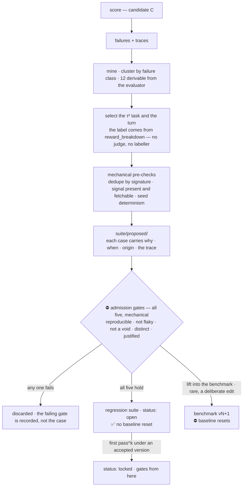

# 02 — The gates

> ⚠️ **Specification, phase 0.** This describes the design; it is not a description of shipped code. `touchstone doctor` is the only implemented command today — see the [README](../README.md) for what runs and what does not. ⛔ **And the specimen changed under it.** D-062 replaced the self-authored infra-RCA corpus with **τ²-bench retail** — 114 tasks, MIT, deterministic DB-state-diff reward. Where this file still says *incident*, *root cause*, *affected service* or *escalate*, it is describing the **archived** specimen (branch `incident-specimen`), not what touchstone measures. **The loop is unchanged; that is the claim the swap was for.**

**This is the project. Everything else is the specimen it operates on.**

A touchstone never changes. A candidate version of the agent ships only if it is better on
something and worse on nothing that mattered before.

---

## 0. Three decisions, and why this file stopped being called "the promotion gate"

**This file was `02-promotion.md` until D-064 and D-065.** The old name was wrong in two ways at
once: it named **one** decision where there are **three**, and the one it named is not the
interesting one.

| | the decision | where it is made | what makes it | ships |
|---|---|---|---|---|
| **1** | refuse a **tool call** | `Environment.make_tool_call()`, at runtime | an extracted constraint plus a mechanical check | **P3.1** |
| **2** | reject a **candidate version** | `loop/compare.py`, at compare time | the five conditions in §2 | **P2.4** |
| **3** | admit a **mined case** into the regression suite | `touchstone suite admit` | the five admission gates in §5 | ⛔ **deferred** (D-030) |

⛔ **All three are mechanical, and that is the invariant this file exists to protect:**

> **Anything that gates is mechanical. Anything with a model in it cannot gate.**

**D-064 is where the model *is* allowed to sit, and the distinction is narrow on purpose.** The
model's only job is **translation** — turn a constraint the customer *stated* into a predicate over
the database. The verdict is then a mechanical evaluation of that predicate against the proposed
call. ⛔ **The gate never judges "did the agent do well."** The moment it does, the gate is an
opinion, and an opinion that blocks a write is the worst of both.

### Why the vocabulary changed at all

"Promote" described a world with one candidate and one decision. It collapsed under the specimen
swap (D-062) because **decision 1 has no analogue in it** — there is nothing to promote when the
question is *"does this tool call execute, right now, before the row is written?"*

⚠️ **Decision 3 is drawn everywhere and built nowhere, and that is stated rather than left to be
noticed.** D-030 cut mining as the fast route's largest single cut. It stays specified here — §5
still carries all five admission gates — because this project has already had one mechanism
specified in full and scheduled by no row (DEF-009 (`DEFECTS.md`)), and the fix for that is not
to stop writing it down. It is to say which of the three ship. **One and two ship. Three is scope.**

---

## 1. The two tiers — and why only one of them freezes

**D-024.** The suite is in two parts, and conflating them is what makes a growing eval
set either dishonest or unusable.

| | **Benchmark** | **Regression suite** |
|---|---|---|
| Size | small — n=10, then 30 | grows forever, never shrinks |
| Purpose | 📊 ***comparing*** candidates → the version table | 🔒 ***gating*** → "did anything that worked stop working?" |
| Changes | rarely, deliberately | ✅ **every reviewed mined failure** |
| Cost of adding a case | ⛔ **the baseline resets** — every prior comparison is void | **nothing** |
| Hash requirement | ⛔ must match to compare | none — it is not a comparison |

**The asymmetry is the whole idea.** A *score* across two different case sets means
nothing, so the benchmark must freeze. A *binary* over "has this ever passed" is well defined
however many cases you add, so the regression suite can grow without corrupting anything —
there is no denominator to corrupt. **Same reason adding a `pytest` test does not invalidate
yesterday's test run.**

⚠️ **The original design had one tier, and that was a defect**: adding a mined case cost the
entire baseline, which prices the mechanism so high it would never run. **A safety mechanism
too expensive to use is the 3-byte-state-file failure in a different costume** (§3).

### The acceptance rule

A candidate **C** is accepted against incumbent **I** if and only if all five hold:

| # | Condition | Why it is there |
|---|---|---|
| 1 | `benchmark_hash(C) == benchmark_hash(I)` | ⛔ **Refuse to compare across different benchmarks.** Otherwise "improvement" can be produced by editing a case, which is the most likely way this project would quietly lie |
| 2 | **No per-case regression on the benchmark** — no case that was `pass^k` under I is less than `pass^k` under C | Aggregate improvement can hide a broken case. This is the condition that does the work |
| 3 | **Strict improvement** on at least one of: mean reward, `pass^k`, cost per success | Prevents accepting a no-op and calling it progress. ⚠️ **Escalation F1 was the fourth axis here and it is cut** — its τ² analogue is `transfer_to_human_agents`, named in **4 of 114** retail tasks and contributing nothing to reward (`ToolType.GENERIC`, returns a constant string) |
| 4 | **No budget breach** — cost per success and p95 latency within the declared budget | An agent that gets better by calling ten more tools has not gotten better |
| 5 | **No `locked` regression case fails** — see below | The one-way condition: what has ever worked keeps working, across every version, forever |

Anything else is a **reject**, and a reject is written to `results/` exactly like an accept — ⛔ **the rejection is the more valuable of the two.**

### `open` → `locked`: why a mined case cannot gate on arrival

**A mined case is by definition one the agent just failed.** If it gated immediately, every
mined case would block every candidate forever and the loop would be unusable. So each
regression case carries a status:

| status | Behaviour | Set by |
|---|---|---|
| `open` | ✅ Reported in `results/`, ⛔ **does not gate** | on entry — the agent cannot pass it yet |
| `locked` | 🔒 **Gates from here on** | **automatically**, the first time an *accepted* version scores it `pass^k` |
| `quarantined` | Reported, does not gate, reason required | human, per §4 |
| `superseded` | Excluded; points at its replacement | human, on a label correction |

⛔ **A `locked` case never unlocks** except through the recorded override path in §4. **The
lock is what makes it one-way** — it is what makes "better on something, worse on nothing"
hold across the whole history rather than only against the previous version.

```bash
touchstone compare v7 --against v6
#   benchmark  ✓ 9f2a1c… matches
#   case 01    3/3 → 3/3  ok
#   case 07    3/3 → 2/3  REGRESSION                     ← blocks (benchmark)
#   case 09    1/3 → 2/3  improved (not decisive)
#   regression 41 locked · 6 open
#     r-018    3/3 → 1/3  REGRESSION  locked at v5       ← blocks
#     r-044    0/3 → 3/3  now passing → LOCKS at v7
#   verdict REJECT — 2 regressions, 1 improvement, 1 new lock
```

### ⚠️ What "passed" means for a stochastic agent — the honest version

Each case runs **k times** (default 3 — `config.K`, D-030). Comparing two three-sample draws is
a statistical question, and treating it as a binary would be the exact failure this repo's whole
discipline exists to prevent.

**So the gate fires on one transition only: `pass^k` → not `pass^k`.** A case the agent used to
get right on every attempt, and now does not.

- **Sharpest at the top.** `3/3 → 2/3` is the transition the gate acts on, and the one the
  sample size resolves best. ⚠️ **It is not a significance test**, and it is *less* resolvable
  at k=3 than it was at 5 — the answer to that is k, not a cleverer rule.
- ⚠️ **Deliberately blind in the middle.** `2/3 → 1/3` is *reported* and never blocks, because
  k=3 has no power to resolve it. **State this out loud rather than implying the gate is
  sharper than it is.**
- 📈 **The upgrade path is k**, not a cleverer statistic. Raising k to 20 buys real power and
  costs wall-clock; the default is 3 because the loop has to be cheap enough to actually run.
  ⚠️ **D-030 cut it from 5 on the grounds that "a per-case binary gate does not spend the extra
  resolution" — the cost of that cut is a wider blind middle**, and it is paid here.

**The rule in one sentence:** the gate fires only on the transition the sample size can
actually resolve, and everything else is reported without being acted on.

---

## 2. The stages

```
                 ┌─────────── the loop that ships ───────────┐
  run ──▶ score ──▶ compare ──▶ accept ──▶ record
                        │                      │
                        └──── mine ◀───────────┘   ⛔ deferred — D-030
                                 │
                                 └─▶ admit ─▶ regression suite
```

⚠️ **`promote` was the fourth verb here and it is retired.** The stage still exists — a candidate
that clears §1's five conditions becomes the incumbent — but the word named a single decision in a
project that has three (§0), and it named the least interesting one. **`accept` is the verb, and
its counterpart `reject` is the deliverable**: a candidate that gets refused, with the task that
refused it named, is the strongest artifact this project can produce.

⛔ **`mine` and `admit` are deferred**, not optional. Everything downstream of `score` in that
second row is scope, and §5 keeps its full specification so that deferring it stays a decision
rather than an omission.

### 1. `run`

Executes candidate C against **every case in both tiers** — the frozen benchmark and the whole
regression suite — **k times each**, emitting OpenTelemetry spans. Writes nothing but traces.
Idempotent per `(version, case, attempt)` so an interrupted run resumes.

⚠️ **The regression tier is what makes a run get slower over time**, and that is the cost the
two-tier design accepts on purpose: it buys a gate that never forgets. When it stops fitting
the quota, §4 says what gives — sample the `open` cases, seeded and declared, and ⛔ **never
the `locked` ones.**

### 2. `score`

Reads the **spans**, not the prose ([docs/04](04-observability.md)). Produces
`results/<version>.json`: per case, per attempt — reward and its `reward_breakdown` split, `termination_reason`, tool calls,
tokens, latency; then the aggregates.

### 3. `compare`

Applies §1 against the incumbent. Emits a per-case table and a verdict.

### 4. `accept`

Writes the version into `results/index.json` as the new incumbent. **In CI this is the gate**
— a rejected candidate fails the job.

⚠️ **Accepting is the cheap half.** The stage exists so that *rejecting* has somewhere to happen,
and §3 is the check that it can.

### 5. `mine`

**Every failure becomes a candidate case, and the machine does everything except say yes.**

A case that failed carries a trace showing *how*. The mine stage clusters failures by the
**way** the session failed. For τ²-bench retail that taxonomy is not invented here — it is the ten
`TerminationReason` values (`data_model/simulation.py:1254` in [tau2-bench](https://github.com/sierra-research/tau2-bench) **1.0.1**, MIT) crossed with **whether the mechanical `DB` component came back zero** (D-069), and it proposes cases that isolate that confusion.

⛔ **Cluster on `reward_breakdown["DB"]`, never on the composite reward.** Retail declares `reward_basis = ["DB", "NL_ASSERTION"]` on 112 of its 114 tasks, so the composite has a judge in it and cannot gate — D-069. The `DB` key is written separately by `evaluator_env.py:153` and is mechanical. *(An earlier pass here said the two live components were `DB` and `COMMUNICATE`; that was measured off 1,824 leaderboard simulations run against the superseded task set — `DEFECTS.md` DEF-036.)*

⚠️ **This paragraph described generating new incidents with a planted root cause, and that
capability left with the specimen (D-062, D-066).** τ²'s 114 retail tasks are upstream and are
**never** regenerated here — mining selects and annotates, it does not author. That is a real
reduction in what `mine` can do, and it is the price of not owning the corpus, which is the whole
point of the swap.

> This is [`evalloop`](https://github.com/sandeepyadav1478/evalloop)'s idea with a real domain
> under it. Cite it; it predates this project.



#### ⛔ Admission is mechanical, and no human is a step in it

A wrong case gates *correct* behaviour forever, and you would debug it as an agent regression.
§4 calls a wrong label the most valuable defect this project can produce. **So the last stage
before a case can gate anything is the strictest one — it is just not a person.**

⚠️ **This used to be a batch human review, and the argument for it was that "a wrong label
entering silently is poison."** That is true and it is why the step existed. It does not apply
here, for a reason specific to this domain: **nothing is labelled at mine time.** A mined case
carries τ²'s own `reward_breakdown` as its label — computed by the benchmark's evaluator, not by
us and not by a judge (§2), so the label was correct before the failure happened. There is no labelling act to get wrong —
which this document already said: *review is a batch approval over machine-prepared cases,
never a labelling task.*

**What that review was actually doing is admission control** — *is this failure worth locking
into the suite forever?* — and every one of its criteria is computable from artefacts the
pipeline already produces:

| Admission gate | The check | Where it comes from |
|---|---|---|
| **Reproducible** | fails on **every** one of k attempts, not some | `pass^k` — [docs/05](05-scoring.md) §2 |
| **Not flaky** | re-run reproduces the failure. ⚠️ **No seed to hold** — the user simulator is a model, so this is *k out of k* rather than byte-identical replay, and it is a weaker guarantee than the archived specimen's. Stated, not hedged | §4's flaky-case row |
| **Not a void** | no quota rejection, no `infrastructure_error`, no `unexpected_error` — the attempt actually happened | the four attempt statuses, [docs/09](09-schemas.md) §6 |
| **Distinct** | no two cases share a `task_id`. ⛔ **Weaker than it looks and weaker than it was**: the 114 are upstream and fixed, so *distinct* can only mean *not the same task twice*, never *not the same failure twice* | [docs/01](01-spec.md) §6 |
| **Justified** | non-empty `why`, `added`, `origin` | [docs/01](01-spec.md) §6, invariant 11 |

**Four of the five were already specified machinery**, which is the tell: the reviewer was
applying criteria that were written down. `origin` records `mined` and the version that
produced it; **`admitted_by` records the gate set that admitted the case, not a name.**

⚠️ **The field was `reviewed_by` and it is renamed, for the same reason `APPROVAL_THRESHOLD`
was ([docs/09](09-schemas.md) §10).** A field named after a person is read as a person having
looked, and the first draft of this section kept the prose above while the JSON below still
said `"reviewed_by": "sandeep"` — the rename is what stops that recurring. It is **free**: the
provenance fields are outside `benchmark_hash` by construction ([docs/09](09-schemas.md) §5).

⚠️ **The cost, stated rather than hidden.** A degenerate case that passes all five is now
admitted with nobody having looked at it. The recovery path is the regression tier itself: if
it ever refuses a candidate on a case that inspection shows should not have been admitted,
review comes back as an **offline batch that quarantines** — never as a step a run waits on.
D-040.

#### Provenance — every case says why it exists and when it arrived

**A suite you cannot read the history of is a suite you will eventually stop trusting.** So
every case carries its own record, in its `manifest.json` entry:

```json
{
  "id": "r-018",
  "tier": "regression",
  "task_id": "47",
  "domain": "retail",
  "status": "locked",
  "added": "2026-09-02",
  "added_in": "regression v7",
  "origin": "mined",
  "why": "v6 zeroed reward_breakdown[DB] on 4 of 5 attempts for task 47 — it cancelled the wrong order line after the user corrected itself mid-conversation. termination_reason was agent_stop every time, so it finished confidently.",
  "mined_from": {
    "version": "v6", "case": "inc-009",
    "confusion": ["cache_stampede", "db_pool_exhausted"],
    "trace_id": "4bf92f35…"
  },
  "admitted_by": ["reproducible", "not_flaky", "not_a_void", "distinct", "justified"],
  "admitted": "2026-09-02",
  "locked_at": "v7",
  "supersedes": null, "superseded_by": null,
  "history": [
    {"date": "2026-09-14", "change": "quarantined",
     "why": "oscillates 3/3 ↔ 2/3 across identical runs — a coin flip in the case, not the agent"},
    {"date": "2026-09-21", "change": "unquarantined",
     "why": "cause was an unseeded jitter in the metric renderer; fixed in generate.py, seed now reproduces"}
  ]
}
```

| Field | Rule |
|---|---|
| `origin` | `seeded` · `mined` · `correction` · `manual` — **four kinds, and they read differently** |
| `why` | ⛔ **Required, prose, non-empty — CI fails on a blank one.** Without this the schema decays into fields nobody fills |
| `added` / `reviewed` | Dates, always. *"When did this start gating?"* must be answerable |
| `mined_from` | The trace that produced it. **A mined case links to the failure that justified it** — that is the audit trail the whole loop rests on |
| `history[]` | **Append-only.** Status changes and their reasons; entries are never edited or removed |
| `supersedes` / `superseded_by` | ⛔ A case is **never edited in place.** A wrong label is fixed by adding a corrected case and pointing the two at each other |

**And `suite/CHANGELOG.md`** — one human-readable entry per suite version: what was added, why,
which failures drove it, and what the agent could not do at the time. ⚠️ **Generated from the
manifests, then reviewed** — a hand-maintained changelog is how a reason outlives the fact.

```bash
touchstone suite log              # the changelog, from the manifests
touchstone suite show r-018       # one case: why, when, origin, lock point, full history
touchstone suite diff v6..v7      # what changed between two suite versions, and why
```

**`touchstone suite show` is the payoff.** *"Why is this case here?"* has an answer that names a
date, a version, a trace and a sentence a human wrote — never *"somebody added it at some
point."*

### 6. `record`

Regenerates the README's version table from `results/`. **The table is generated, never hand
written** — a hand-maintained results table is how a number outlives the run that produced it.

---

## 3. 🔴 The negative control — prove the gate can reject

**A gate that has never blocked anything is indistinguishable from no gate.**

The common shape of this failure is a loop that was designed, wired, documented and never
actually ran — the tell is a state file a few bytes long, months after it was built. **This
project must not be able to make that mistake silently.**

**So: `results/negative-control.md` is a required artifact before v0.1.0.** It contains a
deliberately damaged candidate — remove a tool, truncate the context window, corrupt the domain
policy handed to the agent — run through the full pipeline, with:

- the `compare` output showing the regression,
- the CI run that failed, **linked**,
- one sentence on which case broke and what the trace showed.

- [ ] The suite can go red on demand
- [ ] CI actually blocks on it
- [ ] The artifact is committed

⚠️ **Do this at phase 2, not at the end.** A negative control run after everything works is a
performance; run before you trust a single green result.

---

## 4. When the gate is wrong

It will be. Write these in `DEFECTS.md` as they happen.

| Failure | Symptom | What to do |
|---|---|---|
| **Overfitting to the benchmark** | Every candidate improves, real behaviour does not | The benchmark is ten cases. Say so, always, and never quote the correctness number without n. ⛔ `mine` is not the fix — it emits *regression* cases, which gate but never enter the version table, so the comparison stays exactly as easy as it was. A harder comparison needs a new benchmark version, which resets the baseline and costs a re-run of every prior candidate (D-024) |
| **A flaky case** | One case oscillates between 3/3 and 2/3 across identical runs | Not a regression — a case with a coin-flip in it. Quarantine it: `touchstone suite quarantine --why` for a regression case, a hand edit to `suite/benchmark/manifest.json` plus a `DECISIONS.md` entry for a benchmark one. ⚠️ **The benchmark path is deliberately the harder one** — quarantining a benchmark case changes what the table measures |
| **A wrong label** | The agent is right and the key is wrong | **The most valuable defect this project can produce.** Add a corrected case and set `superseded_by` — never edit the frozen one |
| **Gate blocks a real improvement** | A better agent regresses one case | This is the gate working as designed. Override is a human decision, recorded in `DECISIONS.md` with the reason |
| **The regression suite rots** | Locked cases accumulate; some now block for reasons nobody remembers | ⚠️ This is the risk auto-growth adds, and provenance is the answer — `touchstone suite show` gives every locked case a date, a trace and a sentence. ⛔ Never bulk-unlock; quarantine individually, with a reason |

⚠️ **The override path must exist and must be logged.** A gate with no override gets deleted
the first time it is inconvenient; a gate whose overrides are recorded stays honest. **An
override on a `locked` regression case is the strongest form of this** — it is a decision to
ship something that used to work and no longer does, and it belongs in `DECISIONS.md` with the
trace, not in a commit message.

---

## 5. What touchstone is not

- ⛔ **Not learning.** The agent does not update from failures. A human writes each candidate;
  this decides whether it ships. **Never say "self-improving."**
- ⛔ **No auto-tuner** (D-044). Closed-loop designs elsewhere end with a diagnoser that rewrites
  prompts automatically. **The reason for declining it is D-013, not principle:** a candidate is
  `(graph, prompts, parameters, provider, model)` and the version table means something only
  because **one thing changes per version.** A prompt rewrite is an unbounded number of changes at
  once, and it **generates candidates faster than the gate can attribute them** — more rows,
  less information. ✅ **Revival trigger:** an automated generator is admissible the moment its
  output is *one describable change* that fits the table's **what changed** column — a single
  parameter, a single named prompt section. **A free-text rewrite never qualifies.**
- ⚠️ **The *suite* grows automatically; the *agent* does not.** `mine` makes the measurement
  harder, not the agent better — and the two loops turn at different speeds, on purpose. Saying
  "it improves itself" fuses them, and the fused version is the one that is false.
- ⛔ **Not statistical significance testing.** k=3 with a per-case binary gate. §1 states the
  ceiling; do not dress it up.
- ⛔ **Not a general eval framework.** It scores one agent against one benchmark, plus a
  regression suite that only ever answers yes or no.
