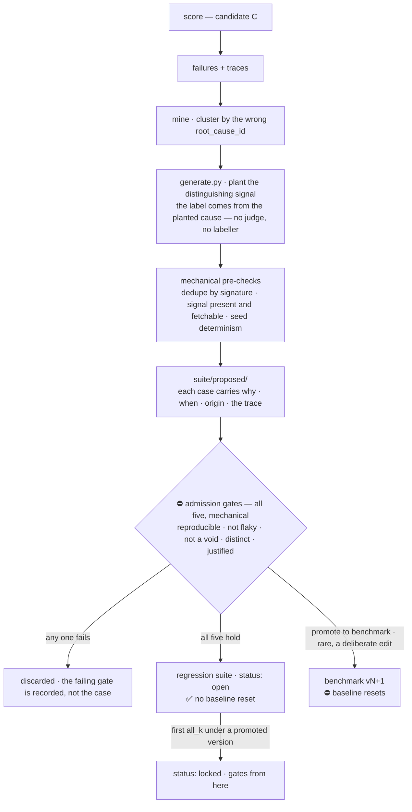

# 02 — The promotion gate

> ⚠️ **Specification, phase 0.** This describes the design; it is not a description of shipped code. `touchstone doctor` is the only implemented command today — see the [README](../README.md) for what runs and what does not.

**This is the project. Everything else is the specimen it operates on.**

A touchstone never changes. A candidate version of the agent ships only if it is better on
something and worse on nothing that mattered before.

---

## 1. The two tiers — and why only one of them freezes

**D-024.** The suite is in two parts, and conflating them is what makes a growing eval
set either dishonest or unusable.

| | **Benchmark** | **Regression suite** |
|---|---|---|
| Size | small — n=10, then 30 | grows forever, never shrinks |
| Purpose | 📊 ***comparing*** candidates → the version table | 🔒 ***gating*** → "did anything that worked stop working?" |
| Changes | rarely, deliberately | ✅ **every reviewed mined failure** |
| Cost of adding a case | ⛔ **the baseline resets** — every prior comparison is void | **nothing** |
| Hash requirement | ⛔ must match to compare | none — it is not a comparison |

**The asymmetry is the whole idea.** A *score* across two different case sets means
nothing, so the benchmark must freeze. A *binary* over "has this ever passed" is well defined
however many cases you add, so the regression suite can grow without corrupting anything —
there is no denominator to corrupt. **Same reason adding a `pytest` test does not invalidate
yesterday's test run.**

⚠️ **The original design had one tier, and that was a defect**: adding a mined case cost the
entire baseline, which prices the mechanism so high it would never run. **A safety mechanism
too expensive to use is the 3-byte-state-file failure in a different costume** (§3).

### The promotion rule

A candidate **C** is promoted against incumbent **I** if and only if all five hold:

| # | Condition | Why it is there |
|---|---|---|
| 1 | `benchmark_hash(C) == benchmark_hash(I)` | ⛔ **Refuse to compare across different benchmarks.** Otherwise "improvement" can be produced by editing a case, which is the most likely way this project would quietly lie |
| 2 | **No per-case regression on the benchmark** — no case that was `all_k` under I is less than `all_k` under C | Aggregate improvement can hide a broken case. This is the condition that does the work |
| 3 | **Strict improvement** on at least one of: correctness, `all_k`, escalation F1, cost per correct triage | Prevents promoting a no-op and calling it progress |
| 4 | **No budget breach** — cost per correct triage and p95 latency within the declared budget | An agent that gets better by calling ten more tools has not gotten better |
| 5 | **No `locked` regression case fails** — see below | The one-way condition: what has ever worked keeps working, across every version, forever |

Anything else is a **reject**, and a reject is written to `results/` exactly like a promote.

### `open` → `locked`: why a mined case cannot gate on arrival

**A mined case is by definition one the agent just failed.** If it gated immediately, every
mined case would block every candidate forever and the loop would be unusable. So each
regression case carries a status:

| status | Behaviour | Set by |
|---|---|---|
| `open` | ✅ Reported in `results/`, ⛔ **does not gate** | on entry — the agent cannot pass it yet |
| `locked` | 🔒 **Gates from here on** | **automatically**, the first time a *promoted* version scores it `all_k` |
| `quarantined` | Reported, does not gate, reason required | human, per §4 |
| `superseded` | Excluded; points at its replacement | human, on a label correction |

⛔ **A `locked` case never unlocks** except through the recorded override path in §4. **The
lock is what makes it one-way** — it is what makes "better on something, worse on nothing"
hold across the whole history rather than only against the previous version.

```bash
touchstone compare v7 --against v6
#   benchmark  ✓ 9f2a1c… matches
#   case 01    3/3 → 3/3  ok
#   case 07    3/3 → 2/3  REGRESSION                     ← blocks (benchmark)
#   case 09    1/3 → 2/3  improved (not decisive)
#   regression 41 locked · 6 open
#     r-018    3/3 → 1/3  REGRESSION  locked at v5       ← blocks
#     r-044    0/3 → 3/3  now passing → LOCKS at v7
#   verdict REJECT — 2 regressions, 1 improvement, 1 new lock
```

### ⚠️ What "passed" means for a stochastic agent — the honest version

Each case runs **k times** (default 3 — `config.K`, D-030). Comparing two three-sample draws is
a statistical question, and treating it as a binary would be the exact failure this repo's whole
discipline exists to prevent.

**So the gate fires on one transition only: `all_k` → not `all_k`.** A case the agent used to
get right on every attempt, and now does not.

- **Sharpest at the top.** `3/3 → 2/3` is the transition the gate acts on, and the one the
  sample size resolves best. ⚠️ **It is not a significance test**, and it is *less* resolvable
  at k=3 than it was at 5 — the answer to that is k, not a cleverer rule.
- ⚠️ **Deliberately blind in the middle.** `2/3 → 1/3` is *reported* and never blocks, because
  k=3 has no power to resolve it. **State this out loud rather than implying the gate is
  sharper than it is.**
- 📈 **The upgrade path is k**, not a cleverer statistic. Raising k to 20 buys real power and
  costs wall-clock; the default is 3 because the loop has to be cheap enough to actually run.
  ⚠️ **D-030 cut it from 5 on the grounds that "a per-case binary gate does not spend the extra
  resolution" — the cost of that cut is a wider blind middle**, and it is paid here.

**The rule in one sentence:** the gate fires only on the transition the sample size can
actually resolve, and everything else is reported without being acted on.

---

## 2. The six stages

```
  run ──▶ score ──▶ compare ──▶ promote ──▶ record
                        │                      │
                        └──── mine ◀───────────┘
```

### 1. `run`

Executes candidate C against **every case in both tiers** — the frozen benchmark and the whole
regression suite — **k times each**, emitting OpenTelemetry spans. Writes nothing but traces.
Idempotent per `(version, case, attempt)` so an interrupted run resumes.

⚠️ **The regression tier is what makes a run get slower over time**, and that is the cost the
two-tier design accepts on purpose: it buys a gate that never forgets. When it stops fitting
the quota, §4 says what gives — sample the `open` cases, seeded and declared, and ⛔ **never
the `locked` ones.**

### 2. `score`

Reads the **spans**, not the prose ([docs/04](04-observability.md)). Produces
`results/<version>.json`: per case, per attempt — correctness, escalation, tool calls,
tokens, latency; then the aggregates.

### 3. `compare`

Applies §1 against the incumbent. Emits a per-case table and a verdict.

### 4. `promote`

Writes the version into `results/index.json` as the new incumbent. **In CI this is the gate**
— a rejected candidate fails the job.

### 5. `mine`

**Every failure becomes a candidate case, and the machine does everything except say yes.**

A case that failed carries a trace showing *how*. The mine stage clusters failures by the
wrong `root_cause_id` the agent chose, and proposes new incidents that isolate that confusion
— if the agent keeps calling `cache_stampede` when it is `db_pool_exhausted`, generate cases
that differ only in the distinguishing signal.

> This is [`evalloop`](https://github.com/sandeepyadav1478/evalloop)'s idea with a real domain
> under it. Cite it; it predates this project.



#### ⛔ Admission is mechanical, and no human is a step in it

A wrong case gates *correct* behaviour forever, and you would debug it as an agent regression.
§4 calls a wrong label the most valuable defect this project can produce. **So the last stage
before a case can gate anything is the strictest one — it is just not a person.**

⚠️ **This used to be a batch human review, and the argument for it was that "a wrong label
entering silently is poison."** That is true and it is why the step existed. It does not apply
here, for a reason specific to this domain: **nothing is labelled at mine time.** A mined case
is one the generator produced with its root cause planted before the agent ever saw it (§2), so
the label was correct before the failure happened. There is no labelling act to get wrong —
which this document already said: *review is a batch approval over machine-prepared cases,
never a labelling task.*

**What that review was actually doing is admission control** — *is this failure worth locking
into the suite forever?* — and every one of its criteria is computable from artefacts the
pipeline already produces:

| Admission gate | The check | Where it comes from |
|---|---|---|
| **Reproducible** | fails on **every** one of k attempts, not some | `all_k`, §3 |
| **Not flaky** | re-run at the same seed reproduces the failure | §6's flaky-case rule |
| **Not a void** | no `429`, no tool error, no `hops_exhausted` — the attempt actually happened | [docs/05](05-scoring.md) §6 |
| **Distinct** | no case in either tier shares `(root_cause_id, affected_service, seed)` | [docs/01](01-spec.md) §6, invariant 9 |
| **Justified** | non-empty `why`, `added`, `origin` | [docs/01](01-spec.md) §6, invariant 11 |

**Four of the five were already specified machinery**, which is the tell: the reviewer was
applying criteria that were written down. `origin` records `mined` and the version that
produced it; **`reviewed_by` records the gate set that admitted the case, not a name.**

⚠️ **The cost, stated rather than hidden.** A degenerate case that passes all five is now
admitted with nobody having looked at it. The recovery path is the regression tier itself: if
it ever refuses a promotion on a case that inspection shows should not have been admitted,
review comes back as an **offline batch that quarantines** — never as a step a run waits on.
D-040.

#### Provenance — every case says why it exists and when it arrived

**A suite you cannot read the history of is a suite you will eventually stop trusting.** So
every case carries its own record, in its `manifest.json` entry:

```json
{
  "id": "r-018",
  "tier": "regression",
  "root_cause_id": "db_pool_exhausted",
  "seed": 88123,
  "status": "locked",
  "added": "2026-09-02",
  "added_in": "regression v7",
  "origin": "mined",
  "why": "v6 answered cache_stampede on 4 of 5 attempts for inc-009. This isolates the distinguishing signal — pool wait time — with topology, traffic and deploy history held identical.",
  "mined_from": {
    "version": "v6", "case": "inc-009",
    "confusion": ["cache_stampede", "db_pool_exhausted"],
    "trace_id": "4bf92f35…"
  },
  "reviewed_by": "sandeep", "reviewed": "2026-09-02",
  "locked_at": "v7",
  "supersedes": null, "superseded_by": null,
  "history": [
    {"date": "2026-09-14", "change": "quarantined",
     "why": "oscillates 3/3 ↔ 2/3 across identical runs — a coin flip in the case, not the agent"},
    {"date": "2026-09-21", "change": "unquarantined",
     "why": "cause was an unseeded jitter in the metric renderer; fixed in generate.py, seed now reproduces"}
  ]
}
```

| Field | Rule |
|---|---|
| `origin` | `seeded` · `mined` · `correction` · `manual` — **four kinds, and they read differently** |
| `why` | ⛔ **Required, prose, non-empty — CI fails on a blank one.** Without this the schema decays into fields nobody fills |
| `added` / `reviewed` | Dates, always. *"When did this start gating?"* must be answerable |
| `mined_from` | The trace that produced it. **A mined case links to the failure that justified it** — that is the audit trail the whole loop rests on |
| `history[]` | **Append-only.** Status changes and their reasons; entries are never edited or removed |
| `supersedes` / `superseded_by` | ⛔ A case is **never edited in place.** A wrong label is fixed by adding a corrected case and pointing the two at each other |

**And `suite/CHANGELOG.md`** — one human-readable entry per suite version: what was added, why,
which failures drove it, and what the agent could not do at the time. ⚠️ **Generated from the
manifests, then reviewed** — a hand-maintained changelog is how a reason outlives the fact.

```bash
touchstone suite log              # the changelog, from the manifests
touchstone suite show r-018       # one case: why, when, origin, lock point, full history
touchstone suite diff v6..v7      # what changed between two suite versions, and why
```

**`touchstone suite show` is the payoff.** *"Why is this case here?"* has an answer that names a
date, a version, a trace and a sentence a human wrote — never *"somebody added it at some
point."*

### 6. `record`

Regenerates the README's version table from `results/`. **The table is generated, never hand
written** — a hand-maintained results table is how a number outlives the run that produced it.

---

## 3. 🔴 The negative control — prove the gate can reject

**A gate that has never blocked anything is indistinguishable from no gate.**

The common shape of this failure is a loop that was designed, wired, documented and never
actually ran — the tell is a state file a few bytes long, months after it was built. **This
project must not be able to make that mistake silently.**

**So: `results/negative-control.md` is a required artifact before v0.1.0.** It contains a
deliberately damaged candidate — remove a tool, truncate the context window, drop a specialist
— run through the full pipeline, with:

- the `compare` output showing the regression,
- the CI run that failed, **linked**,
- one sentence on which case broke and what the trace showed.

- [ ] The suite can go red on demand
- [ ] CI actually blocks on it
- [ ] The artifact is committed

⚠️ **Do this at phase 2, not at the end.** A negative control run after everything works is a
performance; run before you trust a single green result.

---

## 4. When the gate is wrong

It will be. Write these in `DEFECTS.md` as they happen.

| Failure | Symptom | What to do |
|---|---|---|
| **Overfitting to the benchmark** | Every candidate improves, real behaviour does not | The benchmark is ten cases. Say so, always, and never quote the correctness number without n. ⛔ `mine` is not the fix — it emits *regression* cases, which gate but never enter the version table, so the comparison stays exactly as easy as it was. A harder comparison needs a new benchmark version, which resets the baseline and costs a re-run of every prior candidate (D-024) |
| **A flaky case** | One case oscillates between 3/3 and 2/3 across identical runs | Not a regression — a case with a coin-flip in it. Quarantine it: `touchstone suite quarantine --why` for a regression case, a hand edit to `suite/benchmark/manifest.json` plus a `DECISIONS.md` entry for a benchmark one. ⚠️ **The benchmark path is deliberately the harder one** — quarantining a benchmark case changes what the table measures |
| **A wrong label** | The agent is right and the key is wrong | **The most valuable defect this project can produce.** Add a corrected case and set `superseded_by` — never edit the frozen one |
| **Gate blocks a real improvement** | A better agent regresses one case | This is the gate working as designed. Override is a human decision, recorded in `DECISIONS.md` with the reason |
| **The regression suite rots** | Locked cases accumulate; some now block for reasons nobody remembers | ⚠️ This is the risk auto-growth adds, and provenance is the answer — `touchstone suite show` gives every locked case a date, a trace and a sentence. ⛔ Never bulk-unlock; quarantine individually, with a reason |

⚠️ **The override path must exist and must be logged.** A gate with no override gets deleted
the first time it is inconvenient; a gate whose overrides are recorded stays honest. **An
override on a `locked` regression case is the strongest form of this** — it is a decision to
ship something that used to work and no longer does, and it belongs in `DECISIONS.md` with the
trace, not in a commit message.

---

## 5. What touchstone is not

- ⛔ **Not learning.** The agent does not update from failures. A human writes each candidate;
  this decides whether it ships. **Never say "self-improving."**
- ⚠️ **The *suite* grows automatically; the *agent* does not.** `mine` makes the measurement
  harder, not the agent better — and the two loops turn at different speeds, on purpose. Saying
  "it improves itself" fuses them, and the fused version is the one that is false.
- ⛔ **Not statistical significance testing.** k=3 with a per-case binary gate. §1 states the
  ceiling; do not dress it up.
- ⛔ **Not a general eval framework.** It scores one agent against one benchmark, plus a
  regression suite that only ever answers yes or no.
