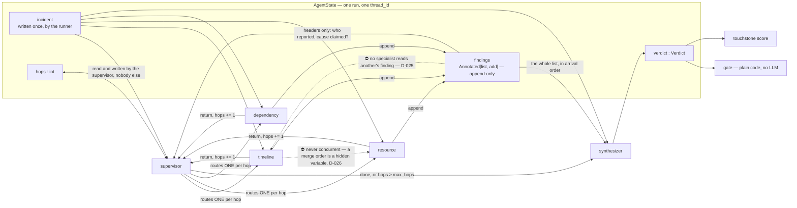

# 03 — The agent and its tools

**The agent is the specimen, not the point.** It exists to be a thing touchstone can measure
versions of. Keep it small enough that a change is attributable.

---

## 1. The graph

```
        ┌─────────────┐
        │  supervisor │◀────────────┐
        └──────┬──────┘             │
               │ ONE per hop        │ up to `max_hops`
     ┌─────────┼─────────┐          │
     ▼         ▼         ▼          │
 timeline  resource  dependency ────┘
     └─────────┼─────────┘
               ▼  (after the loop exits)
        ┌─────────────┐
        │ synthesizer │  → Verdict
        └──────┬──────┘
               ▼
        ┌─────────────┐
        │    gate     │  blast radius ≥ restart_service? → interrupt()
        └─────────────┘
```

LangGraph, `StateGraph`, SQLite checkpointer. The supervisor picks the next specialist or
decides it has enough; `max_hops` bounds the loop and is a versioned parameter — **`config.MAX_HOPS`,
6 at v2, three specialists each reachable twice** (D-039). The number is quoted from the constant
and never restated here, for the reason DEF-003 records about `k`.

⚠️ **The bound is a hypothesis, and the loop is instrumented to break it.** `hops_exhausted`
([docs/05](05-scoring.md) §6) fires when this edge exits because `hops ≥ max_hops` rather than
because the supervisor emitted `done` — the two are told apart by the last
`touchstone.node.supervisor` span's `next`, so it needs no extra state key.

⚠️ **The three arrows are a choice of one, not a fan-out.** Exactly one specialist runs per hop
and control returns to the supervisor. **This drawing said fan-out and the sentence above it
said routing, for one full pass** — which is the ambiguity [docs/07](07-diagrams.md) §2 requires
a diagram to be *checkable* on, caught in review of the docs rather than of the code. D-026.

### State: who writes, who reads

**This is the shared-memory design, and the read side is the half that carries the risk.**

| Key | Written by | Read by |
|---|---|---|
| `incident` | the runner, once | everyone |
| `findings` | **each specialist, append-only** (`Annotated[list, add]`, D-012) | ⛔ **the synthesizer only** |
| `hops` | supervisor | supervisor |
| `verdict` | synthesizer | gate, scorer |

⛔ **A specialist never reads another specialist's finding.** Its prompt is the incident plus its
own prior tool results. The supervisor sees finding *headers* — who has reported, and whether it
claims a cause — because that is what routing needs and nothing more.

**The reason is the failure this project measures, one scope smaller.**
[docs/08](08-memory.md) §4 treats anchoring as *memory's* failure — retrieve a plausible
precedent, never fetch the signal that refutes it. It is shared state's failure, and a
blackboard every specialist reads has it from v2, three versions before memory exists:
`timeline` reports *"deploy at 14:02"*, `resource` reads it before investigating, inherits the
framing, stops looking. A blackboard is memory with a one-run TTL. It also destroys the one
thing three specialists are for — once `resource`'s output depends on `timeline`'s, a
correctness movement is attributable to neither. D-025.

⚠️ **`add` concatenates disagreement rather than resolving it, and that is deliberate.** When
`timeline` says *the deploy* and `dependency` says *the downstream datastore*, both survive to
the synthesizer. **A reducer that de-duplicated or picked a winner would hide the disagreement**,
and specialist disagreement is the strongest available signal for `insufficient_evidence`.

### The state diagram — the two edges that must not exist

[docs/07](07-diagrams.md) §2 requires a diagram to name *"what is in state and which fields are
reduced"*. **A reducer is the write side, and the write side was never the risk.** This is the
read side drawn, which is what D-025 and D-026 actually decide.



**The two dotted edges are the design.** The first is anchoring: a specialist that reads
`timeline`'s *"deploy at 14:02"* inherits the framing and stops looking, and correctness then
moves for a reason attributable to neither node. The second is D-026: with concurrent writes the
list order is decided by which model call returns first, so **the same case can flip at
`temperature: 0`** — and D-011 defines exactly that as a *defect*, so the orchestration would be
manufacturing the class of failure the instrument exists to detect.

⚠️ **This is a spec diagram, not the committed artifact, and it is deliberately partial.** It is
the v2 state, and it carries no failure paths — parse failure, tool error, interrupt, void
run. [docs/07](07-diagrams.md) §2 calls a happy-path-only diagram *"the single most common way
this gate gets faked"*, so the phase-1 artifact had to add them before any node was written.
Naming the gap here is what stops this picture being mistaken for that one.

✅ **It did: [`diagrams/touchstone.eraser`](../diagrams/touchstone.eraser) §6 draws all four
terminal statuses, and §3 draws the state read/write edges.** ⛔ **The artifact is not
`diagrams/v2-graph.mmd`** — that name was promised here, never created, and is retired by D-036;
one file draws every phase. **The gap this paragraph names is closed, and the paragraph stays
because it is what closed it.**

### The three specialists

Each owns one question. **One question each is what makes a version diff attributable** — if
a candidate changes and correctness moves, you know which specialist to look at.

| Specialist | The question it answers | Tools |
|---|---|---|
| `timeline` | *Did something change?* | `get_deploys`, `get_logs` |
| `resource` | *What is saturated?* | `get_metrics`, `get_logs` |
| `dependency` | *Is it us or something we call?* | `get_topology`, `get_metrics` |

The **synthesizer** sees each specialist's finding and emits the structured `Verdict`. It has
no tools — it decides, it does not investigate.

⛔ **No fourth specialist without a number in the version table that moves.** The scope rule from
`ROADMAP.md`, and this is the exact place it would be broken.

### The versions in the README table

| version | graph |
|---|---|
| **v1** | **One node. The alert text, no tools, straight to a verdict.** A deliberately weak baseline — a baseline that is already good hides whatever the rest of the work does |
| **v2** | Supervisor + three specialists + synthesizer |
| **v3** | v2 + `search_runbooks` on the supervisor |
| **v4** | v3 + a tool-call budget enforced in the supervisor |
| **v5** *(deferred — D-030)* | v4 + `search_incident_history` on the supervisor. ⛔ **Same nodes, same edges** — memory is a tool, not a specialist, which is what keeps it one delta. [docs/08](08-memory.md), D-023 |

### What each step is expected to buy — written down before the run

**A prediction is only worth recording if it can be wrong.** These are here so that a step which
does not move its number is read as a **finding** rather than as a bug to hunt.

| step | the delta | expected direction | if it does not happen |
|---|---|---|---|
| v1 → v2 | three specialists behind a supervisor | `correct` and `all_k` **up**; `cost_per_correct` **up** — more nodes cost more, and that trade is the thing being measured | routing is not earning its cost, and that is the README's result. ⛔ Never fix it by weakening v1 further |
| v2 → v3 | `search_runbooks` | `correct` up **on the ten diagnosable classes only** — there is no runbook for `insufficient_evidence` ([docs/09](09-schemas.md) §7), so escalation F1 should be flat | flat correctness means retrieval does not help here. **First check a decoy is ever returned at all** — a top-3 that never surfaces one is a corpus bug wearing a finding's clothes |
| v3 → v4 | a tool-call budget | `tool_calls_mean` and `cost_per_correct` **down**; `correct` and `all_k` **flat** | correctness dropping means the threshold is too tight. ⛔ It is set from the measured v1–v3 distribution (ROADMAP P2.3), never raised afterwards to rescue a run |
| v4 → v5 | `search_incident_history` | up on `precedent: true`, **down on `false_friend`**, flat on `none` — that shape is the hypothesis, not the hope | any other shape is the finding and it is published. ⛔ Dropping v5 because it lost is the failure mode, D-023 |

⛔ **Magnitudes are deliberately not predicted.** At n=10 and k=3 a stratum holds two or three
cases, so a predicted percentage would be a number invented before the measurement — the exact
failure this design exists to refuse. **Directions are falsifiable, and that is enough.**

---

## 2. The five tools

**All read-only.** They read the generated incident — there is no live system.

```python
get_logs(service: str, window: TimeWindow, grep: str | None = None) -> LogPage
get_metrics(service: str, metric: str, window: TimeWindow) -> Series
get_deploys(service: str, window: TimeWindow) -> list[Deploy]
get_topology() -> list[ServiceNode]
search_runbooks(query: str) -> list[RunbookChunk]

# v5 only — the sixth tool, over a frozen corpus of past resolved incidents
search_incident_history(signature: Signature) -> list[PastIncident]
```

**Design rules, and each one exists for a scoring reason:**

1. ⛔ **Evidence is never in the prompt.** The agent gets the alert and must *fetch* the rest.
   A prompt containing the logs would make the trace uninformative and tool count meaningless.
2. **`get_logs` truncates and says so.** Returns at most `n` lines in a `LogPage` carrying
   `truncated` and `total` ([docs/09](09-schemas.md) §3 — the return type is an envelope for
   exactly this reason). **A tool that silently truncates teaches the agent to trust a partial
   view** — and the honest marker is what lets a specialist ask again.
3. **`get_metrics` requires a named metric.** No "give me everything" call. The agent must
   form a hypothesis to ask a question, which is the behaviour being measured.
4. **`search_runbooks` is the only retrieval through v4.** Small corpus of hand-written
   runbooks, one per root-cause class plus three decoys. ⚠️ **The decoys matter** — retrieval
   that can only return correct answers is not retrieval. **v5 adds a second corpus and its
   decoys are a different animal**: a runbook decoy is wrong and *irrelevant*, a false-friend
   precedent is wrong and *compelling* — same service, same signature, different cause. That
   asymmetry is the point of [docs/08](08-memory.md), not a detail of it.
5. **Every tool call is a span** with its arguments and result size. The scorer counts them;
   see [docs/04](04-observability.md).

### The same five, served over MCP — phase 2 (D-019)

`tools/mcp_server.py` exposes exactly these functions over the Model Context Protocol, and
`langchain-mcp-adapters` bridges them back into LangGraph. **One definition, two surfaces** —
the schemas already exist, so this is an adapter and a compose service, not a subsystem.

| | |
|---|---|
| Why | **One tool definition, one transport, both callers.** The CLI spawns the server on stdio; the API reaches its own over the network. `langchain-mcp-adapters` hands back ordinary LangChain tools either way, so binding them costs about what binding local functions costs |
| ⚠️ Trap | `mcp~=2.0` and `langchain-mcp-adapters` **do not resolve together at any published version**, and the resolver disguises it as a success. Pin `mcp~=1.24`; the class is **`FastMCP`** (D-031) |
| 🔴 Reversed | This row read *"⛔ Not the tool path inside the measured loop — LangGraph calls the functions directly"* until the phase-0 topology diagram (D-030). **It is now the measured path**: numbers in the version table that never traversed the protocol would make MCP a demo rather than a dependency. A **transport** failure voids the attempt as a 429 does; a **tool** returning an error still scores |
| ⛔ Not | Five servers, or a server per tool. One server, five tools, **each of which calls something real** — the `axiom` scaffolding mistake is the one to avoid here |

---

## 3. The approval interrupt

Actions at or above `restart_service` ([docs/01](01-spec.md) §5) stop the graph:

```python
if action.blast_radius >= BlastRadius.SERVICE_LIVE:
    decision = interrupt({"action": action, "verdict": verdict})
```

The run halts at a checkpoint. `touchstone approve <run_id> --yes|--no` resumes it. The
interrupt is a real LangGraph pause, not a printed warning — **the process can exit and the
run resumes from the checkpointer.**

⚠️ **In suite runs the interrupt is auto-declined** and recorded as `escalated`. Otherwise
scoring would need a human in the loop k times per case. **The interactive path is tested
separately** in `tests/unit/test_interrupt.py`, and the distinction is stated in the results
file — an interrupt that only ever gets auto-answered in the measured path is exactly the kind
of thing that quietly becomes decorative.

---

## 4. Prompts

`prompts/` — one file per node, versioned with the candidate.

- **Structured output, always.** The synthesizer returns a `Verdict` model, not prose. A
  parse failure is a scored failure, not a retry-until-it-works.
- **The reasoning field is free text and is not the primary metric.** [docs/05](05-scoring.md).
- ⛔ **No few-shot examples drawn from either tier — not the frozen benchmark, not the
  regression cases.** That is leakage, and it is the
  easiest way to accidentally publish a great number. Examples, if any, come from cases
  generated with a different seed and are recorded in `DECISIONS.md`.

---

## 5. Models

**Claude, through `claude-agent-sdk` on the Claude Code subscription.** Full manifest, the
auth reasoning and the ~60-line wrapper: [docs/00](00-stack.md) §1–2. Fallbacks are Cerebras
then ollama, in that order.

- The model id is a **versioned parameter** — changing it makes a new candidate, exactly like
  changing a prompt (D-013).
- **The synthesizer's `Verdict` comes back through the SDK's `output_format`**, so it is
  typed at the boundary. **No prose parsing, no retry-until-JSON** — a schema violation is a
  scored `parse_failure`, not a loop.
- ⛔ **`allowed_tools=[]` on every SDK call.** The SDK ships Read/Bash/Glob; a model that can
  reach the filesystem can read `suite/benchmark/truth.json`. **This is the leakage path that would
  produce a perfect score**, and it is one argument.
- ⛔ **`setting_sources=[]`** — 🔴 **not `None`, which is what this line said until 2026-08-14 and
  is the leaky value.** Under `None` the agent inherits this machine's `CLAUDE.md`, skills, MCP
  servers *and its model pin*, so every score depends on files outside the repo (D-034).
  `touchstone doctor` asserts it from the session's own reported context, not from the constant.
- ⛔ **No model routing, no fallback chains inside a candidate.** One model per candidate. A
  provider switch mid-suite voids the run (D-013) rather than mixing it.

⚠️ **`max_turns=2`, meaning one completion.** The SDK can run its own agent loop; here it does
not. **LangGraph owns orchestration and the SDK is transport** — otherwise the graph in the table
is Claude Code's rather than yours, and there is nothing versionable left to measure. The value is
2 rather than 1 only because `output_format` spends a turn on the structured-output step (D-032).
