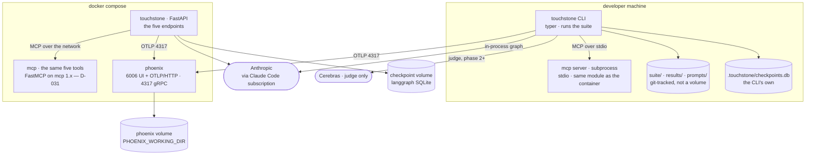

# 06 — Surfaces: CLI, HTTP, compose

> ⚠️ **Specification, phase 0.** This describes the design; it is not a description of shipped code. `touchstone doctor` is the only implemented command today — see the [README](../README.md) for what runs and what does not.

Two surfaces. **The CLI is the primary one** — it is what the loop runs and what CI calls.

**The HTTP service exists for one reason, and it is not "so this is a system rather than a
script."** The approval gate is a **durable** interrupt: the graph stops, the process may exit,
and the resume arrives later — possibly from somewhere else entirely. **A request/response
surface is the only place that property is visible.** `POST /triage` → `202` + `run_id`, the
process is free to die, `POST /runs/{id}/approve` from a different client resumes it off the
checkpointer. In the CLI the same mechanism looks like two commands in one terminal and reads as
convenience. ⛔ **If that path is not demonstrated, the five endpoints below earn nothing and
should not be built** — the acceptance check is in §2.

---

## 1. CLI

```bash
# corpus
touchstone incidents generate --n 10 --seed 1478   # → suite/benchmark/, with truth.json
touchstone incidents show inc-007                  # agent-visible view only
touchstone incidents show inc-007 --truth          # ⚠️ prints the answer key

# the loop
touchstone run     v4 --k 3                        # → traces; one tier until D-024 is built
touchstone score   v4                              # → results/v4.json
touchstone compare v4 --against v3                 # → promote | reject
touchstone promote v4                              # → results/index.json
touchstone record                                  # → regenerates the README table

# ⛔ DEFERRED — designed, not built for v0.2.0 (D-030). Kept here because the design is
#    settled and the reasoning is D-024; ⚠️ nothing below is a working command.
# touchstone mine  v4                              # → suite/proposed/
# touchstone suite log                             # every suite version: what entered, why, when
# touchstone suite show r-018                      # one case: origin, why, the mining trace, history
# touchstone suite diff v6..v7                     # what changed between two suite versions
# touchstone suite review                          # the human step: proposed/ → regression/, one batch
# touchstone suite quarantine r-031 --why "…"      # stops it gating; --why is required

# single incident
touchstone triage inc-007 --version v4             # one run, prints the verdict
touchstone approve <run_id> --yes                  # resumes an interrupted run
```

⚠️ **`--truth` prints the answer key.** It exists for debugging and it is the one command that
must never appear in a doc example whose output is pasted into the README.

**When the `suite` verbs are built, `suite show` is the one that makes a growing suite
defensible** — every case answers *why is this here, who approved it, and what failure produced
it* ([docs/02](02-promotion.md) §5). ⛔ There is never a `touchstone suite unlock`. Overriding a
locked case is a hand edit plus a `DECISIONS.md` entry, on purpose: a gate with a convenient off
switch is not a gate.

⚠️ **The seven commented lines are the fast route's largest cut, and it is safe for one reason:
with no `mine`, no case ever enters the suite, so the baseline cannot reset** — which is the whole
problem D-024 solves. **D-024 stands as a design decision and is unbuilt, not withdrawn.**

**Exit codes are the CI contract:** `0` promote · `1` reject · `2` benchmark hash mismatch ·
`3` run incomplete · `4` a case is missing required provenance (invariant 11 — ⚠️ **reserved,
unreachable until the regression tier exists**). **A reject and
a crash must never share an exit code** — otherwise a broken pipeline reads as a working gate,
which is the failure this whole project is about.

---

## 2. HTTP

FastAPI. Small on purpose.

| Method | Path | Does |
|---|---|---|
| `POST` | `/triage` | Submit an incident, get a verdict. `202` + `run_id` if it interrupts |
| `GET` | `/runs/{run_id}` | Status, verdict, trace id |
| `POST` | `/runs/{run_id}/approve` | Resume an interrupted run |
| `GET` | `/versions` | The version table as JSON — the README's source |
| `GET` | `/healthz` | Liveness |

**`/triage` is async.** A triage takes tens of seconds and may stop at an interrupt; a
synchronous endpoint would have to lie about one or the other.

- [ ] 🔴 **The acceptance check that makes this surface worth building:** `POST /triage` on an
      incident whose action is ≥ `restart_service`, **kill the container**, bring it back, then
      `POST /runs/{id}/approve` and get the completed verdict. ⛔ **Until that has run, the
      durability claim is a mechanism nobody exercised.** It needs the Phoenix-style rule about
      persistence applied to the
      checkpointer too: **the SQLite file is a mounted volume, or the run dies with the process
      and this check cannot pass.**

---

## 3. Compose

```yaml
services:
  touchstone:  # the API
  mcp:         # the five tools over MCP (D-019) — the API's instance; the CLI spawns its own
  phoenix:     # trace backend — ports 6006 (UI + OTLP/HTTP) and 4317 (gRPC)
```

⛔ **Three services, and `ollama` is deliberately not one of them** — see the table below. The
loop needs only `phoenix`; `touchstone` and `mcp` exist for the durable-interrupt path.

⚠️ **Phoenix needs `PHOENIX_SQL_DATABASE_URL` or a mounted `PHOENIX_WORKING_DIR`.** Without one
of them the traces die with the container, and every past row of the version table loses the
evidence behind it. **No collector service** — the app exports OTLP straight to Phoenix; a
collector is a hop with nothing to do at one service.

### The topology — the phase 0 gate diagram (D-021)

**Two volumes and one absent arrow are the whole point of drawing this.**



⛔ **Both volumes are load-bearing and each one fails silently.** Without the Phoenix volume the
traces die with the container and every past row of the version table loses its evidence. Without
the **checkpoint** volume the durable-interrupt check below cannot pass — the run dies with the
process, and the five endpoints earn nothing.

### The four things this picture had to decide

Drawing it forced four questions that the prose had left open. Each is settled here, and the
reason is the same one every time: **the loop has to run without `docker compose up`**, or every
evening starts with docker and the fast route is not fast.

| Question the diagram asked | Settled |
|---|---|
| **Does the CLI reach the tools over MCP, or import them?** | ⭢ **Over MCP, on stdio**, spawning the server as a subprocess. `langchain-mcp-adapters` returns LangChain tools either way, so binding MCP tools costs about what binding local functions costs — and it means **the numbers in the version table actually traversed the protocol.** ⛔ The alternative, importing in the CLI and serving MCP only from the API, would leave the MCP path exercised by nothing that gets measured |
| **Does the CLI share the checkpoint volume?** | ⭢ **No.** The CLI keeps `.touchstone/checkpoints.db` on the host; the container keeps its own on the volume. Sharing one SQLite file across a host process and a container is a locking problem bought for nothing — **the durability claim lives on the HTTP path** and §2's acceptance check is written against it |
| **Is `ollama` in the compose file?** | ⭢ **No — cut.** It was an orphan node here, with no arrow to anything, which is the diagram saying what the prose would not: the judge runs on Cerebras and ollama was a third fallback. It stays documented in [docs/00](00-stack.md) as *use the host's if running*, and **a compose service nothing connects to is maintenance bought for nothing** |
| **One Phoenix project or two?** | ⭢ **One**, `touchstone`. A run span carries `version`, `case_id`, `tier` and `benchmark_hash`, so the scorer selects on those; a stray `POST /triage` demo simply matches no manifest entry. **Two project ids would mean the scorer had to know which surface produced a run**, which is exactly the coupling [docs/04](04-observability.md) §1 exists to avoid |

⛔ **There is no arrow from any container to `suite/`.** The tools read the incident handed to
them; a container that could reach `suite/benchmark/truth.json` is the leakage path that produces
a perfect score ([docs/00](00-stack.md) §2). ⚠️ **`ANTHROPIC_API_KEY` appears nowhere in this
picture** — the subscription path is the CLI's, and a key in the API container's environment
silently switches quota to invoice (D-001).

- [ ] `docker compose up` from a **fresh clone in `/tmp`** produces a working `/healthz`.
      ⚠️ Test it from a clean directory, not the dev tree — the dev tree has state that hides
      missing files.

---

## 4. Deliberately absent

| Not built | Why |
|---|---|
| Auth | Nothing served here is worth protecting, and a login screen would only look like production |
| A web UI | The Phoenix UI shows traces; a bespoke dashboard is a week for nothing |
| Multi-tenancy | One user |
| A real incident source (PagerDuty, Datadog) | ⛔ **It would make the suite unfreezable**, which breaks the version comparison — the point of the project |
| Kubernetes | Compose is the honest scope |

⚠️ **An absence that is explained is a decision; an absence that is not reads as unfinished.**
That is the only reason this table exists — no auth because nothing served here is worth
protecting, and the scope was chosen rather than run out of. **Mirror it in the README's Limits.**
