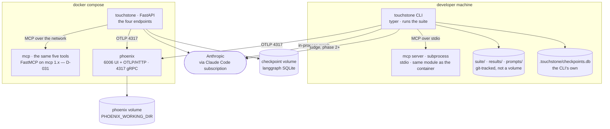

# 06 — Surfaces: CLI, HTTP, compose

> ⚠️ **Specification, phase 0.** This describes the design; it is not a description of shipped code. `touchstone doctor` is the only implemented command today — see the [README](../README.md) for what runs and what does not. ⛔ **And the specimen changed under it.** D-062 replaced the self-authored infra-RCA corpus with **τ²-bench retail** — 114 tasks, MIT, deterministic DB-state-diff reward. Where this file still says *incident*, *root cause*, *affected service* or *escalate*, it is describing the **archived** specimen (branch `incident-specimen`), not what touchstone measures. **The loop is unchanged; that is the claim the swap was for.**

Two surfaces. **The CLI is the primary one** — it is what the loop runs and what CI calls.

🔴 **The HTTP service has lost the reason it was designed for, and this section says so instead
of quietly keeping it.** It existed to make one property visible: the approval gate was a
**durable** interrupt — the graph stopped, the process could exit, and the resume arrived later
from somewhere else entirely, which a request/response surface shows and a CLI disguises as two
commands in one terminal. **D-040 deleted that gate.** No node waits, so nothing needs resuming,
so `POST /triage` is now a request that returns a verdict.

⛔ **This document's own rule was *"if that path is not demonstrated, the five endpoints earn
nothing and should not be built."* The path no longer exists, which is the stronger version of
the same test.** What remains — `/triage`, `/versions`, `/healthz` — is a thin wrapper over CLI
verbs that already work in the loop and in CI.

✅ **DECIDED 2026-08-18: `api.py` is CUT (D-052).** The question stayed open here for one pass
rather than being resolved by whoever was editing this file, and it was answered by the person
entitled to answer it. **Everything below is retained as the specification of a thing that will
not be built** — a cut is a claim, and a reader who asks *"is there an HTTP surface?"* deserves
the answer plus the reason, not silence.

~~⛔ **`docker-compose.yml` and the Phoenix service are NOT cut** and P2.8 still requires them.~~
🔴 **Struck 2026-08-21 by D-074, and the strike is the interesting half.** This line existed to stop
D-040 from over-reaching — the compose file and `api.py` shared a roadmap row and a diagram label,
so cutting one looked like cutting both. The correction was right at the time and is now **empty**:
D-074 removed Phoenix, which was the *only* service left with a reason. `touchstone` served the API
that D-040 cut, `mcp` served `touchstone`.

⛔ **So the compose file has no remaining service and does not exist on disk** (verified
2026-08-21: `ls docker-compose.yml` → no such file). ⚠️ **Two independent decisions each cut part
of a file and neither noticed it had emptied it** — the failure is that a fact defended in writing
outlives the thing it was defending. The roadmap row was also misquoted: Phoenix was **P2.6**
(ROADMAP:284), never P2.8.

**Everything below this line is retained verbatim as the specification of a thing that will not be
built.** It is not maintained against D-074; read it as a dated design, not as the current stack.

⚠️ **The checkpointer is a separate question and is not cut by D-040.** `.touchstone/` also
carries run state for a process that dies mid-run; whether anything still needs that is a phase-1
measurement, not a claim made here.

---

## 1. CLI

```bash
# corpus — ⛔ THE WHOLE GROUP IS GONE (D-062). There is nothing to generate: the 114
#    retail tasks are upstream, read from data/tau2/domains/retail/tasks.json.
# touchstone incidents generate --n 10 --seed 1478
# touchstone incidents show inc-007
# touchstone incidents show inc-007 --truth
touchstone tasks list                              # the 114, id + reward_basis
touchstone tasks show retail_1                     # one task, agent-visible view only
touchstone tasks show retail_1 --criteria          # ⚠️ prints the answer key

# the loop
touchstone run     v4 --k 3                        # → traces; one tier until D-024 is built
touchstone score   v4                              # → results/v4.json
touchstone compare v4 --against v3                 # → promote | reject
touchstone promote v4                              # → results/index.json
touchstone record                                  # → regenerates the README table

# ⛔ NOT BUILT YET — ⚠️ nothing below is a working command. `mine` and `suite admit` are
#    P3.4 / P3.5 (D-070); the reading verbs stay deferred, and the reasoning is D-024.
# touchstone mine  v4                              # THE INNER LOOP: one trace, n attempts
# touchstone suite log                             # every suite version: what entered, why, when
# touchstone suite show r-018                      # one case: origin, why, the mining trace, history
# touchstone suite diff v6..v7                     # what changed between two suite versions
# touchstone suite admit                           # runs the three admission gates: proposed/ → regression/
# touchstone suite quarantine r-031 --why "…"      # stops it gating; --why is required

# single case
touchstone run retail_1 --version v4               # one simulation, prints the reward breakdown
```

⛔ **There is no `touchstone approve`, and there is no `suite review`.** No run ever pauses, so
there is nothing to resume; `suite admit` applies the three mechanical gates in
[docs/02](02-gates.md) §5 and records which one rejected a case. **A human improves this
system by rewriting it — reading traces, changing prompts, adding cases — never by standing
inside a run** (D-040).

⚠️ **`--truth` prints the answer key.** It exists for debugging and it is the one command that
must never appear in a doc example whose output is pasted into the README.

**When the `suite` verbs are built, `suite show` is the one that makes a growing suite
defensible** — every case answers *why is this here, which gates admitted it, and what failure
produced it* ([docs/02](02-gates.md) §5). ⛔ There is never a `touchstone suite unlock`. Overriding a
locked case is a hand edit plus a `DECISIONS.md` entry, on purpose: a gate with a convenient off
switch is not a gate.

⚠️ **The six commented lines are the fast route's largest cut, and it is safe for one reason:
with no `mine`, no case ever enters the suite, so the baseline cannot reset** — which is the whole
problem D-024 solves. **D-024 stands as a design decision and is unbuilt, not withdrawn.**

**Exit codes are the CI contract:** `0` promote · `1` reject · `2` benchmark hash mismatch ·
`3` run incomplete · `4` a case is missing required provenance (invariant 11 — ⚠️ **reserved,
unreachable until the regression tier exists**). **A reject and
a crash must never share an exit code** — otherwise a broken pipeline reads as a working gate,
which is the failure this whole project is about.

---

## 2. HTTP

FastAPI. Small on purpose.

| Method | Path | Does |
|---|---|---|
| `POST` | `/run` | Submit a task id, get the `RewardInfo`. Synchronous — the simulation always terminates, with one of ten `TerminationReason` values |
| `GET` | `/runs/{run_id}` | Status, reward breakdown, trace id — for a run submitted earlier |
| `GET` | `/versions` | The version table as JSON — the README's source |
| `GET` | `/healthz` | Liveness |

⛔ **Two endpoints are gone with D-040**: `POST /runs/{run_id}/approve`, and the `202` + `run_id`
shape of `/run`. Both existed only to expose a pause that no longer happens.

⚠️ **A simulation still takes tens of seconds** — longer now, since it is a multi-turn
conversation with a simulated user rather than one completion — so a synchronous `/run` is a slow
request. An
honest one, but slow. If that turns out to matter, the fix is a job queue with a polled
`/runs/{run_id}`, **which is a different mechanism from a durable interrupt and would need its
own reason.** It is not one this project has yet.

- [ ] 🔴 **This surface no longer has an acceptance check, because the one it had tested the
      interrupt.** It was: submit a case whose action was high blast-radius, kill the
      container, bring it back, approve, get the verdict. **Nothing replaces it, and that is the
      finding** — a surface whose only distinguishing test is gone is a surface with no argument
      for existing. See the note at the top of this file.

---

## 3. Compose

```yaml
services:
  touchstone:  # the API
  mcp:         # the five tools over MCP (D-019) — the API's instance; the CLI spawns its own
  phoenix:     # trace backend — ports 6006 (UI + OTLP/HTTP) and 4317 (gRPC)
```

⛔ **Three services, and `ollama` is deliberately not one of them** — see the table below. **The
loop needs only `phoenix`**; `touchstone` and `mcp` exist for the HTTP surface, whose own
justification is the open question at the top of this file (D-040).

⚠️ **Phoenix needs `PHOENIX_SQL_DATABASE_URL` or a mounted `PHOENIX_WORKING_DIR`.** Without one
of them the traces die with the container, and every past row of the version table loses the
evidence behind it. **No collector service** — the app exports OTLP straight to Phoenix; a
collector is a hop with nothing to do at one service.

### The topology — the phase 0 gate diagram (D-021)

**Two volumes and one absent arrow are the whole point of drawing this.**



⛔ **The Phoenix volume is load-bearing and it fails silently.** Without it the traces die with
the container and every past row of the version table loses its evidence — the failure mode is
that everything keeps working and the evidence quietly stops existing.

⚠️ **The checkpoint volume no longer has a check behind it.** It was there so a killed container
could resume at the approval interrupt; D-040 deleted the interrupt. It is drawn because
`.touchstone/` still holds run state for a process that dies mid-run — **but nothing currently
reads it back, so treat it as unexercised until something does.**

### The four things this picture had to decide

Drawing it forced four questions that the prose had left open. Each is settled here, and the
reason is the same one every time: **the loop has to run without `docker compose up`**, or every
evening starts with docker and the fast route is not fast.

| Question the diagram asked | Settled |
|---|---|
| **Does the CLI reach the tools over MCP, or import them?** | ⭢ **Over MCP, on stdio**, spawning the server as a subprocess. `langchain-mcp-adapters` returns LangChain tools either way, so binding MCP tools costs about what binding local functions costs — and it means **the numbers in the version table actually traversed the protocol.** ⛔ The alternative, importing in the CLI and serving MCP only from the API, would leave the MCP path exercised by nothing that gets measured |
| **Does the CLI share the checkpoint volume?** | ⭢ **No.** The CLI keeps `.touchstone/checkpoints.db` on the host; the container keeps its own on the volume. Sharing one SQLite file across a host process and a container is a locking problem bought for nothing. ⚠️ **The answer survives D-040; its reason does not.** It was *"the durability claim lives on the HTTP path"* — there is no durability claim now. What still holds is the locking argument, which never depended on the interrupt |
| **Is `ollama` in the compose file?** | ⭢ **No — cut.** It was an orphan node here, with no arrow to anything, which is the diagram saying what the prose would not. 🔴 **The original reason given was *"the judge runs on Cerebras and ollama was a third fallback"*, and that reason is retired** — D-067 makes every role Anthropic and both a `doctor` diagnostic. The verdict is unchanged and the argument is now *stronger*: **a compose service nothing connects to is maintenance bought for nothing**, and nothing connects to it because nothing may |
| **One trace project or two?** *(asked as "one Phoenix project or two"; D-074 changed the vendor, not the question)* | ⭢ **One**, `touchstone`. A run span carries `version`, `tier` and `benchmark_hash`, and its simulation spans carry `task_id`, so the scorer selects on those; a stray `POST /triage` demo simply matches no manifest entry. **Two project ids would mean the scorer had to know which surface produced a run**, which is exactly the coupling [docs/04](04-observability.md) §1 exists to avoid |

⛔ **There is no arrow from any container to `suite/`.** The tools read the environment handed to
them; a container that could reach `suite/benchmark/truth.json` is the leakage path that produces
a perfect score ([docs/00](00-stack.md) §2). ⚠️ **`ANTHROPIC_API_KEY` appears nowhere in this
picture** — the subscription path is the CLI's, and a key in the API container's environment
silently switches quota to invoice (D-001).

- [ ] `docker compose up` from a **fresh clone in `/tmp`** produces a working `/healthz`.
      ⚠️ Test it from a clean directory, not the dev tree — the dev tree has state that hides
      missing files.

---

## 4. Deliberately absent

| Not built | Why |
|---|---|
| Auth | Nothing served here is worth protecting, and a login screen would only look like production |
| A web UI | 🔴 **The reason changed with D-074, the verdict did not.** It was *"the Phoenix UI shows traces"*; there is no bundled UI now. A bespoke dashboard is still a week for nothing — [docs/04](04-observability.md) §"the monitoring row" is the argument, and it never depended on a UI existing elsewhere |
| Multi-tenancy | One user |
| A real order-management backend, or a live customer channel | ⛔ **It would make the suite unfreezable**, which breaks the version comparison — the point of the project |
| Kubernetes | Compose is the honest scope |

⚠️ **An absence that is explained is a decision; an absence that is not reads as unfinished.**
That is the only reason this table exists — no auth because nothing served here is worth
protecting, and the scope was chosen rather than run out of. **Mirror it in the README's Limits.**
