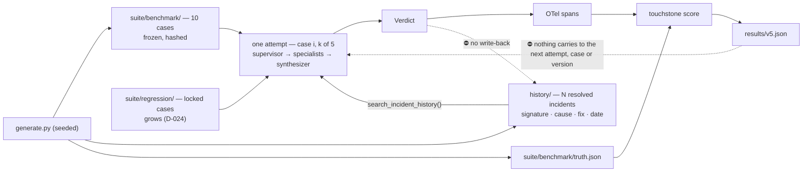

# 08 — Memory: where it goes, and the failure it is there to catch

> ⚠️ **Specification, phase 0.** This describes the design; it is not a description of shipped code. `touchstone doctor` is the only implemented command today — see the [README](../README.md) for what runs and what does not. ⛔ **And the specimen changed under it.** D-062 replaced the self-authored infra-RCA corpus with **τ²-bench retail** — 114 tasks, MIT, deterministic DB-state-diff reward. Where this file still says *incident*, *root cause*, *affected service* or *escalate*, it is describing the **archived** specimen (branch `incident-specimen`), not what touchstone measures. **The loop is unchanged; that is the claim the swap was for.**

🔴 **CUT TWICE — read this before anything below it.** **D-030 cut v5**, and then **D-062 cut
the corpus v5 would have read.** Nothing in this file is scheduled, and `history/`, `mem0` and
the negative control are not on the roadmap. It is kept whole rather than archived for one
reason: **§4 and §8 are the only place in this repo where the *false-friend* argument is worked
out end to end** — that a retrieval version which changes nothing scores identically to one that
helps, and that you cannot tell them apart without a control. That argument is specimen-free and
it is the reason docs/05 reports the judged dimension beside the gate instead of inside it.

⛔ **And `v5` below no longer names this.** D-071 gave **v5** to the LangGraph retail agent, which
is scheduled ([docs/03](03-agent-and-tools.md) §1). Every `v5` in *this* file means the cut memory
version, and if memory is ever revived it takes **the next free number**, not this one. ⚠️ **A
version number that names two systems makes every earlier row in the table ambiguous** — the
number was free because the design was cut, and a cut design does not hold a reservation.

⚠️ **§9's conclusion survives the cut and is the one to carry forward**: mem0 goes nowhere, and
**the write path is the reason** — a store that writes during a scored run has made the run
un-repeatable, whatever it retrieves. That is a fact about scored runs, not about the specimen,
so it binds τ²-bench retail exactly as it bound the incident suite.

---

**The earlier answer was too small.** D-022 established that memory must not be infrastructure,
which is correct and still stands. It left the impression that memory is a coin-flip experiment
— *"we tried it, maybe it helped"* — and an agent whose only memory story is a null result reads
as an agent that does not have memory.

This file is the second pass: **where memory legitimately belongs in a frozen-suite benchmark,
what it buys, and the specific failure it is designed to expose.**

---

## 1. Six places memory could live. Five of them are wrong.

Memory is not one thing — it is a **scope**. The question is never *"should the agent have
memory"*, it is *"what does state survive, and across what boundary?"* Six boundaries exist
here, and the verdict differs on every one.

| # | State survives across… | Verdict | Why |
|---|---|---|---|
| 1 | **hops inside one attempt** | ⛔ Not memory | That is LangGraph state, and it already exists ([docs/03](03-agent-and-tools.md)). Calling it memory is a rename |
| 2 | **the k attempts of one case** | ⛔ Never | Attempts 2–5 become recall. `all_k` stops measuring reliability — the metric the project exists to report |
| 3 | **cases inside one suite run** *(the agent's own verdicts)* | ⛔ Never | Primes case 12 with case 07: leakage from the frozen benchmark, and it makes **case order** a hidden parameter |
| 4 | **candidate versions** | ⛔ Never | v5's score would depend on v1–v4 having run. **The version comparison is the product** |
| 5 | ✅ **a frozen corpus of past *resolved* incidents, generated once, disjoint from the suite** | **This is the one** | It is not the agent remembering its own runs. It is **the organisation's history**, held constant exactly like the runbooks are |
| 6 | ✅ **runs, with extraction and consolidation** | ✅ Deferred, separate mode | The write path — the only scope where extraction and consolidation are even questions. **And the answer there is not mem0 either: it is the suite's own gate, D-027, §9.** Never in the promotion table |

**Rows 2–4 are D-022 and nothing there changed.** Row 5 is what D-022 missed, and it is the
whole of this file.

⛔ **Two more were considered and cut.** *Memory of operator approve/decline decisions* is
genuinely valuable in production — approval fatigue is a real operational cost — but **there is
no operator here to produce that signal**: D-040 removed every point at which a run waits on a
person, so nothing emits an approve/decline event and there is nothing to measure. *Caching tool
results across attempts* is a cache, not memory, and it would corrupt the tool-call metric.

---

## 2. The move: history is **environment**, not agent state

The contamination argument in D-022 is about the agent remembering **the suite**. It says
nothing about the agent having access to a **past** — and every real on-call engineer has one.
The first question a human asks is *"have we seen this before?"*

So: **the generator emits a second frozen artifact.**

```
suite/benchmark/        10 cases the version table is computed on — frozen, hashed
suite/regression/       the mined cases that gate                 — grows (D-024)
history/                N resolved incidents with their outcomes  — frozen, hashed
  each entry: signature · root cause · affected service · the fix · a date
```

⚠️ **`history/` is frozen like the benchmark, not growing like the regression tier**, and the
two are unrelated: a mined regression case is a *test*, a history entry is *environment*. ⛔ **A
failure the agent produced never becomes a history entry** — that is the write path invariant 10
bans, and it is the whole reason this design is measurable (§5).

Both come from the same seeded generator ([docs/01](01-spec.md) §4), so this is **not new
machinery** — it is the existing generator run with different seeds and the truth left *in*.

**Why this is clean, checked against all four contamination levels:**

- **Identical for every attempt** → `all_k` still measures reliability.
- **Identical for every case** → no ordering effect, no cross-case priming.
- **Identical for every candidate** → v5 vs v4 is still one delta.
- **Disjoint from the suite** → no case's own answer is in it. Enforced by hash and asserted.

**It is held constant in exactly the way the runbook corpus is held constant.** That is the
entire argument, and it is why this needs no second suite — the resolution D-022's own
*"Wrong if"* line predicted, arriving from a different direction than it expected.

---

## 3. ⚠️ "Isn't this just the runbook retrieval renamed?"

**Ask this first, because if the answer is yes the whole design is a rename** — and renaming an
existing capability is the most common way a design fools the person writing it.

It is not, and the differences are structural rather than cosmetic:

| | `search_runbooks` (v3) | `search_incident_history` (v5) |
|---|---|---|
| Content | **Prescriptive, generic** — *"if pool wait climbs, check…"* | **Episodic, dated, service-specific** — *"2026-03-14, billing-api, this signature"* |
| Retrieval key | Symptom **vocabulary** | Signature **similarity** — metric shape, topology, alert |
| Carries an outcome | No | ✅ **Yes — the cause and the fix that worked** |
| Its decoys are… | Wrong and **irrelevant** — they test retrieval precision | Wrong and **compelling** — same service, same signature, different cause |

**That last row is the design.** A decoy runbook tests whether retrieval returns the right
document. A **false-friend precedent** tests whether the agent can refuse a plausible answer it
was just handed. Those are different failure modes and only the second one is interesting.

---

## 4. The false friend — what this is actually measuring

Memory's real production failure is not that it fails to retrieve. It is **anchoring**: the
agent finds a past incident with a matching surface signature, answers with *its* root cause,
and never fetches the signal that distinguishes them. Confident, fluent, wrong — and wrong in
the way that is hardest to notice, because it cites evidence.

**This is the exact analogue of a trap the suite already has.** [docs/01](01-spec.md) §2 plants
`alert.service` as a wrong answer, because answering with the alerting service is the most
common naive triage failure. **Memory introduces a second naive failure, and it can be planted
the same way.**

So every **benchmark** case gets one more label in `suite/benchmark/manifest.json`:

| `precedent` | The history corpus contains… | Memory should… |
|---|---|---|
| `true` | a past incident with the same signature **and** the same cause | **help** |
| 🔴 `false_friend` | a past incident with the same signature and a **different** cause, with the distinguishing signal present in this incident | **hurt — this is the finding** |
| `none` | nothing close | be **neutral** (measures distraction) |

⚠️ **A `false_friend` case is generated by the existing rule 4 method** — generate a normal
incident, then place a near-twin in *history* rather than removing a signal. Generator rules 1–3
([docs/01](01-spec.md) §4) are unchanged; the truth is still never rendered.

**Regression cases carry no `precedent` label, deliberately.** The label exists to *stratify a
rate*, and the regression tier reports a binary — "has this ever passed" — with no rate to
stratify (D-024). A mined case whose failure looks like anchoring says so in its `why` field,
which is prose a human wrote and is worth more here than a label a generator stamped.

### What this produces

**A matrix, not a number.**

| stratum | v4 (no memory) | v5 (memory) | what a movement means |
|---|---|---|---|
| `true` | ⟨…⟩ | ⟨…⟩ | recall is worth something |
| 🔴 `false_friend` | ⟨…⟩ | ⟨…⟩ | **anchoring, measured** |
| `none` | ⟨…⟩ | ⟨…⟩ | distraction cost |

**And the gate already handles it, with no change to the promotion rule.** Condition 2 is
per-case no-regression ([docs/02](02-gates.md) §1). If memory helps six cases and breaks
two false friends, **the gate rejects the candidate** — and that rejection, with the trace under
it, is the strongest single artifact this project can produce:

> *"Memory raised average correctness and the gate rejected it, because it broke two cases the
> agent used to pass every time. The trace shows it citing the March incident and never fetching
> the metric that told the two apart. That is the failure mode every memory deployment has, and
> this is what it looks like measured."*

The alternative write-up is *"we tested memory and it did not help."* Same work, same evening,
and only one of the two is a result.

---

## 5. The diagram — the reset boundary, which is the whole validity argument

[docs/07](07-diagrams.md) §7 requires the v5 diagram to show **where the store is read, written
and cleared**. Written and cleared are the interesting halves, because here the answer is
*never* and *not applicable* — and a picture makes that checkable.



**The two dotted edges are the design.** They are the ones that must not exist, and each is
asserted in a test — read-only file mode on `history/`, and a fresh process per attempt.

⚠️ **This is a spec diagram, not the committed artifact.** If v5 is ever built it earns a
section in [`diagrams/touchstone.eraser`](../diagrams/touchstone.eraser), committed **before**
the v5 implementation commit (D-021). Noting that here so the gate is not silently skipped on
the one change that prompted it. ⛔ **Not `diagrams/v5-memory-graph.mmd`** — that filename was
promised in two places and retired by D-036 without ever existing (DEF-006). **v5 is cut by
D-030**, so this is a conditional.

---

## 6. What actually gets built — one delta, no new dependency

| Piece | Cost | Why it is small |
|---|---|---|
| `history/` corpus | ~nothing | The generator already exists, is seeded and is deterministic (invariant 6). Different seeds, truth left in |
| `precedent` label per case | one field | The generator plants the root cause, so it already knows |
| `search_incident_history(signature)` | one tool | **Same retrieval mechanism as `search_runbooks`** over a corpus of comparable size. ⛔ No vector database — see the ceiling in §9 |
| Stratified reporting | a group-by | **No new metric.** `correct` and `all_k` grouped by an existing label |

⛔ **v5 changes no node and no edge.** Memory is a tool on the supervisor, exactly as runbooks
were at v3 — which keeps the graph identical to v4 and keeps v5 a single attributable delta. A
"memory specialist" would change the graph and the retrieval in one candidate, which is two
changes and is the thing D-021 exists to stop.

**Still one evening, and it is deferred (D-030) behind the n=30 benchmark.**

---

## 7. What n=10 can and cannot say — state this before the run

⚠️ **At n=10 the strata are 3 / 2 / 5 at best**, and two or three cases are already
`insufficient_evidence`. A stratum of two supports a **case study**, never a rate.

**So the honest split, decided in advance:**

- **Valid at n=10: the gate result.** Condition 2 fires on a single per-case regression, and
  *"the gate rejected v5, here is the case and here is the trace"* needs no rate at all. This is
  the deliverable.
- ⛔ **Not valid at n=10: any percentage per stratum.** *"Memory costs 40% on false friends"*
  is a percentage with a denominator of two, and the denominator never travels with the quote.
  Report counts (`2/2 → 0/2`), never percentages.
- 📈 **The upgrade is n=30**, which is the deferred item directly above this one — so if the
  *rate* is wanted, **the benchmark grows first and memory comes after it.** The two are
  sequential, not alternative, and pretending otherwise is how a deferred list becomes three
  things at 80%.

---

## 8. The negative control — because retrieval that changes nothing looks identical to retrieval

[docs/02](02-gates.md) §3 requires proof the gate can reject. **Memory needs its own,
for a different reason:** a retrieval tool that is never actually used produces the same numbers
as one that is used and does not help. Both look like a null result.

**So: run v5 against a shuffled history corpus** — same size, same shapes, outcomes permuted so
every precedent is wrong.

- Score **drops** → memory is being used, and the true-precedent gain was real.
- Score **unchanged** → 🔴 **the retrieval is decorative.** The tool is being called and ignored,
  or never called. That is a defect in v5, not a finding about memory.

⚠️ **Run this before reporting anything about memory.** A retrieval tool that is wired, called
and quietly ignored reports exactly like one that works. **The shuffled-corpus control is the
only cheap check that separates them**, and it costs one extra suite run.

---

## 9. So where does mem0 actually go? — nowhere, and the write path is the reason

**Not in the read path.** The history corpus is frozen and read-only, so what it needs is
*retrieval*, and mem0's real features — LLM-based extraction of what to store, and
ADD/UPDATE/DELETE consolidation when new information contradicts old — **have nothing to
operate on.** Using a memory layer as a read-only vector store is adopting a dependency for its
category name, which D-022 already rejected.

**The write path is where the hard problems live.** Two of them, in row 6 of §1:

1. **Extraction** — after a run, what is worth storing? The whole trace, the verdict, or a
   distilled lesson? Getting this wrong poisons every later retrieval.
2. **Consolidation** — a new incident contradicts a stored belief (*"pool exhaustion on
   billing-api is always a migration"* — until once it is a traffic spike). ADD, UPDATE or
   DELETE is a decision, and it is the part nobody demos.

🔴 **And mem0 is not the answer to either, which took a second pass to see.** Its ADD/UPDATE/
DELETE consolidation is **an LLM deciding whether a new fact contradicts an old one** — a second
inference step that can be wrong, that fails *silently*, that fails *permanently*, and that
fails in the direction of confidence. There is no exception and no alarm. **It is the never-ran
feedback loop again, except with a plausible file where the empty one was** — which is worse,
because nothing looks wrong. Adopting it would replace a gate with a guess.

### The mechanism: a memory is a candidate (D-027)

**The question is not where to put a memory. It is what refuses a wrong one** — and this project
already owns that machinery, so the write path is D-024's pipeline pointed at a different store:

| | |
|---|---|
| **Who may write** | ⛔ Not the agent. A candidate memory is emitted **only from a run whose verdict scored correct against the answer key** — in production, from an incident a human closed with a confirmed cause |
| **Where it lands** | `proposed`, never `resolved`. The same five mechanical admission gates promote it as promote a mined case ([docs/02](02-gates.md) §5) — ⛔ **no human step, and the `why` is still required**, written by whatever produced it |
| **What refuses it** | Promotion condition 2, unchanged. A memory that lifts average correctness while breaking one previously-passing case is exactly what a poisoned memory looks like, and the gate already rejects that candidate. No new rule |
| **old vs new** | **Supersession, never deletion** — `superseded` is already a case status (D-024). A memory about a rewritten service is not wrong, it is *expired*, and the record has to keep the difference. `TTLConfig.default_ttl` ages out what nobody retrieves |
| **Retractability** | Invariant 11's fields — `why`, `added`, `origin` — plus the `run_id` and trace. ⛔ **A memory you cannot trace is a memory you cannot retract** |

**The store is `langgraph.store.BaseStore`, already in the stack, no new dependency.** Verified
from source in `langgraph` 1.2.10 rather than from documentation: `namespace: tuple[str, ...]`
with `list_namespaces()`, `created_at`/`updated_at` on every `Item`, `TTLConfig`, `IndexConfig`
plus `base/embed.py` for optional semantic search, and `SqliteStore` shipped inside
**`langgraph-checkpoint-sqlite`** — the package [docs/00](00-stack.md) already pins for the
checkpointer.

**One store, namespaced — not one per agent.** Per-specialist stores let `timeline` and
`dependency` hold contradictory beliefs with nothing to reconcile them. Namespaces scope reads;
one gated path owns writes. Same shape as D-025: many readers, one writer.

⚠️ **The alternative worth naming is Zep/Graphiti**, the only library here that models
**bi-temporal validity** natively — *believed true from T1, invalid at T2* — which is a genuine
answer to old-vs-new. It is also a server plus a graph database — **two more processes to keep
alive so that one retrieval tool can answer**, which is the wrong ratio for a component that is
still a candidate. **The open question here is not which store to run; it is what happens when a
memory is wrong**, and that is answerable with the store already pinned.

⛔ **And it cannot go in the promotion table**, because writes reintroduce every contamination
in §1. It is a separate longitudinal mode: fixed committed case order, k=1, reported as a
curve — correctness on case *i* against how many cases preceded it — with the order hash
beside it. Deferred, its own results file, never a row in the version table.

⚠️ **And the confound gets stated first:** on a small suite over eleven root-cause classes, a
rising curve is mostly the agent learning **the answer-key distribution**, not learning to
triage. Which means the longitudinal mode needs n=30 and a shuffled control before it says
anything — see §7 and §8. **That is why it sits behind the n=30 benchmark on the deferred list,
and never gets bolted onto `v0.2.0` as a stretch goal.**

---

## 10. Ceilings

- ⛔ **Not "long-term memory". Not "learning".** Nothing trains, nothing updates weights. It is
  retrieval over a corpus of past incidents, and the difference matters: one word implying a
  system that learned something is a claim nobody can withdraw once it has been read.
- ⛔ **Not a claim that memory helps.** The design measures whether it helps *and where it
  hurts*; publishing only the half that flatters is the failure this whole repo is built against.
- ⚠️ **The history corpus is synthetic, like everything else here.** A generated precedent is
  cleaner than a real postmortem, which makes the true-precedent gain an **upper bound**.
- ⚠️ **Retrieval quality is not being measured.** Signature matching over a small corpus is
  deliberately simple. If a result turns on retrieval precision, that is a confound to name, not
  a number to quote.
- ⛔ **Never say the agent "remembers".** It queries a frozen corpus that is identical on every
  attempt. The design's whole validity rests on that distinction.

---

## 11. The curator's registry — a second memory, and it is not the one above

⚠️ **Everything before this section is the *agent's* memory: the thing under test, frozen,
reset per attempt, and the subject of the validity argument in §5.** This section is a
different object with the same word attached, and conflating them is the failure the section
exists to prevent. **They differ on every axis that matters:**

| | The agent's memory (§1–§10) | **The curator's registry** (this section) |
|---|---|---|
| Who reads it | the agent under test | the **inner loop** ([docs/02](02-gates.md) §2) |
| Lifetime | **frozen**; identical on every attempt | **grows** across traces, within a version |
| Reset boundary | per attempt — §5 is the whole argument | per `context_hash` (below) |
| If it is wrong | the measurement is invalid | the loop wastes a turn |
| Is it a variable under test? | ✅ **yes, it is the experiment** | ⛔ **no** — it is loop plumbing |

🎯 **The registry answers exactly one question: _has this already been dealt with?_** Without
it the inner loop re-derives the same rule from the fiftieth instance of one failure, and `n`
iterations buy one rule instead of `n`.

### 11.1 Two memories, and only one of them can be exact

| | **Positive** — rules already admitted | **Negative** — traces already refused |
|---|---|---|
| Key | the admitted rule's own identity | a **signature** over the failure |
| Match | **exact** — it is a set membership test | **heuristic**, and known to be |
| Cost of a false positive | a duplicate rule, caught by the admit gate | ⚠️ **a real failure silently skipped** |
| Cost of a false negative | — | a wasted iteration |

⛔ **Do not let the negative side pretend to be exact.** A signature over a failure is a
bucketing heuristic and every published system that shipped one under-counted or over-counted
by orders of magnitude. Igor (CCS'21) measures stack-hash-style deduplication at **1–2 orders
of magnitude** of over-count and coverage-based bucketing at **2–3**. A design that hides that
behind an equality operator is claiming a precision nobody has achieved.

### 11.2 The four mechanisms, and the reason each is there

1. **Minimize, then fingerprint — never fingerprint the raw trace.** The signature is taken
   over a **backward dynamic slice from the violating write**, not over the trace that
   contained it. This is ClusterFuzz's ordering and it is load-bearing: two traces that differ
   in fifty irrelevant turns and agree on the three that caused the write must land in the same
   bucket, and no hash over the unminimized artifact does that. ⛔ **The naive
   "hash the failing state" design is the one Igor measures as 1–2 OOM wrong.**

2. **Two phases, each declaring its direction.** WER (SOSP'09) separates **labeling** —
   expanding, one bucket per distinguishable cause — from **classifying** — condensing,
   merging buckets that share a cause. **A heuristic must say which it is**, because the two
   have opposite failure modes and a single "dedup" step that does both is unauditable.
   Phase 1 expands and may over-split; phase 2 condenses and may over-merge. Recorded
   separately, so a bad merge is visible as a bad merge.

3. **Derived, never stored.** The signature is recomputed at read time from a versioned
   function, and `sig_version` is stored beside the trace. **Re-bucketing is therefore a
   version bump, not a migration** — WER's `!analyze` re-bucketed a corpus of 300M reports
   this way. ⛔ **A stored hash freezes a heuristic you already know is wrong**, and the
   registry's whole value is that it can be improved after it has been used.

4. **Prevalence ranking, which is what makes the errors cheap.** Buckets are worked in order
   of how many traces fall in them. This is why WER's over-splitting was survivable and it is
   the mechanism, not a hope: an over-split bucket is small, so it sinks; an under-split bucket
   is large, so it surfaces and gets looked at. ⚠️ **Without ranking, neither error self-drains
   and the registry degrades silently.** *(This was asserted as "errors are cheap in both
   directions" before the mechanism was named — a hedge with no stated mechanism is worse than
   no hedge.)*

### 11.3 Scope, and why it is not a TTL

```
context_hash = sha(policy.md, prompt_version, tau2_version)
```

**A registry entry is valid for the context that produced it and no other.** Change the policy
and every "already refused" verdict is stale — not old, *wrong*, because the thing that refused
it is gone. ⛔ **A TTL is the wrong instrument**: it expires correct entries on a timer and
keeps incorrect ones until the timer fires. The registry is **bi-temporal** — an entry records
both when it was written and which context it was written under — so an old verdict stays
readable as history without being consulted as fact.

### 11.4 Two health metrics, reported or the registry is unaudited

| Metric | What it catches | Direction |
|---|---|---|
| **Singleton rate** — buckets of size 1 | over-splitting; the registry is doing nothing | rising = worse |
| **Max bucket size** | over-merging; distinct failures fused into one | rising = worse |

⚠️ **Both, or neither.** Each metric is trivially gamed by the error the other one catches — a
signature that buckets everything together scores perfectly on singleton rate. **They are the
cross-foot.** *(WER's "one-hit wonders" are the singleton case, named as a known and accepted
cost rather than a defect.)*

### 11.5 Ceilings

- ⛔ **Not built.** The inner loop is `P3.4`/`P3.5`, specified and unbuilt ([docs/02](02-gates.md) §2).
  This section is a design, and a design doc is authoritative for what was *considered*, never
  for what was *done*.
- ⚠️ **The prior art is from crash triage, not agent traces.** WER, Igor and ClusterFuzz bucket
  crashes; the analogy to a policy violation is argued, not measured. **The mechanisms transfer;
  the published error magnitudes do not** — quoting Igor's 1–2 OOM as *this* system's error rate
  would be borrowing a number from a different population.
- ⛔ **Never call this "the agent learning".** It is the *harness* remembering what it has
  already looked at. The agent is unchanged between iterations by construction — [docs/02](02-gates.md) §2:
  *"the suite grows automatically; the agent does not."*
